# Actividades AWS - Semana 5

## Introducción

Durante el Día 3 de la Semana 5 trabajé con distintos servicios de Amazon Web Services para desplegar la API de **TaskFlow** en la nube.

El objetivo de la práctica fue preparar una cuenta segura, crear una instancia EC2, desplegar una aplicación Java, crear una base de datos PostgreSQL en Amazon RDS, almacenar el artefacto de la aplicación en Amazon S3 y comprobar que TaskFlow funcionara públicamente desde AWS.

En cada bloque documento **qué hice**, **para qué sirve**, **qué observé** y los problemas que se presentaron durante la práctica.

---

# Día 3 - Fundamentos, EC2, S3, VPC y RDS

## 1. La cuenta, segura

### MP-1 - Presupuesto antes que nada

#### Qué hice

Antes de crear infraestructura configuré un presupuesto mensual llamado `taskflow-5usd` con un límite de **5 USD**.

El objetivo fue tener visibilidad del consumo generado durante las prácticas y detectar posibles cargos inesperados mientras utilizaba servicios como EC2 y RDS.

#### Para qué sirve

AWS Budgets permite establecer un monto de referencia y monitorear el consumo de la cuenta. El presupuesto no detiene automáticamente los recursos al alcanzar el límite, pero ayuda a controlar y detectar gastos.

#### Qué vi

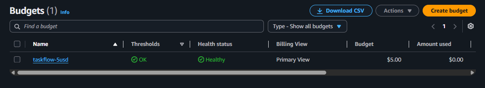

La captura muestra el presupuesto `taskflow-5usd` con un límite de **5 USD**, un consumo de **0.00 USD** y estado saludable al momento de realizar la práctica.

---

### MP-2 - Asegurar la cuenta

#### Qué hice

Para evitar trabajar directamente con la cuenta principal, utilicé un usuario IAM llamado `taskflow-admin`.

También configuré autenticación multifactor (MFA) mediante un dispositivo virtual como segunda capa de seguridad para el inicio de sesión.

#### Para qué sirve

IAM permite administrar identidades y permisos dentro de AWS. Separar el trabajo cotidiano de la cuenta principal reduce el uso innecesario de credenciales con privilegios elevados.

MFA agrega un segundo factor de autenticación además de la contraseña.

#### Qué vi

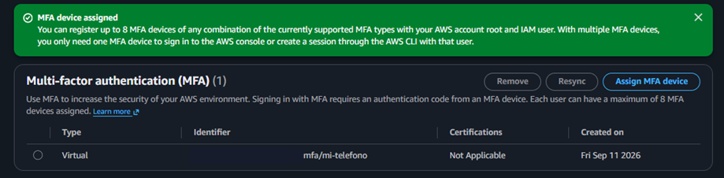

La evidencia muestra que se asignó correctamente un dispositivo MFA virtual.

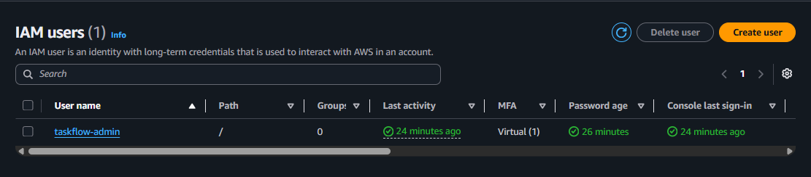

La captura muestra el usuario `taskflow-admin` con MFA configurado, que fue la identidad utilizada para continuar con las actividades de AWS.

---

## 2. EC2

### MP-3 - Lanzar la instancia EC2

#### Qué hice

Creé una instancia de Amazon EC2 llamada `taskflow-ec2` para utilizarla como servidor de la aplicación TaskFlow.

La instancia se creó como `t3.micro` y quedó en estado `Running`.

Además, configuré el Security Group para permitir:

- Puerto **22 (SSH)** únicamente desde mi dirección IP.
- Puerto **8080 (TCP)** desde internet para poder acceder públicamente a Swagger durante la práctica.

#### Para qué sirve

Amazon EC2 proporciona una máquina virtual en AWS donde puedo instalar software y ejecutar la aplicación Java sin depender de mi computadora local.

El Security Group actúa como firewall de la instancia y permite definir qué tráfico puede entrar o salir.

#### Qué vi

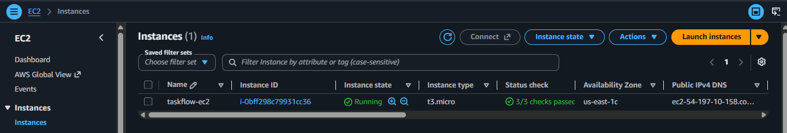

La captura muestra la instancia `taskflow-ec2` en estado `Running`, con los chequeos de estado aprobados y lista para continuar con la conexión SSH.

---

### MP-4 - Conectar por SSH

#### Qué hice

Desde Git Bash utilicé la llave privada asociada a la instancia para conectarme por SSH.

Primero ajusté los permisos del archivo `.pem`:

```bash
chmod 400 taskflow-key.pem
```

Después realicé la conexión:

```bash
ssh -i taskflow-key.pem ec2-user@<IP_PUBLICA_EC2>
```

#### Para qué sirve

SSH permite administrar remotamente una instancia Linux mediante una terminal segura. Desde esta sesión pude instalar o verificar software, ejecutar comandos y administrar TaskFlow.

#### Qué vi

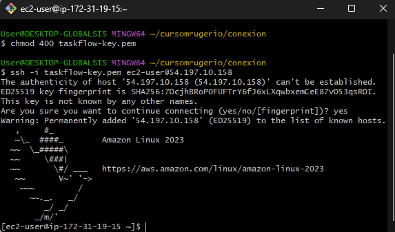

La captura muestra el inicio de sesión correcto en **Amazon Linux 2023** y el prompt del usuario `ec2-user`, confirmando que la conexión SSH funcionó.

---

### MP-5 - Java en la EC2

#### Qué hice

Ya conectado a EC2 verifiqué que Java estuviera instalado ejecutando:

```bash
java -version
```

#### Para qué sirve

TaskFlow es una aplicación Java, por lo que la instancia necesita una versión compatible de Java para ejecutar el archivo JAR.

#### Qué vi

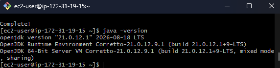

La salida confirmó que la instancia tenía disponible **OpenJDK 21 mediante Amazon Corretto**, por lo que estaba preparada para ejecutar TaskFlow.

---

### MP-6 - El JAR viaja

#### Qué hice

Desde mi computadora generé el artefacto ejecutable de TaskFlow con Maven:

```bash
mvn -q -DskipTests package
```

Después verifiqué el archivo creado en `target/` y lo transferí a EC2 mediante `scp`:

```bash
scp -i <RUTA_LLAVE> \
  target/taskflow-api-3.0.0.jar \
  ec2-user@<IP_PUBLICA_EC2>:~/taskflow-api.jar
```

#### Para qué sirve

Maven empaqueta la aplicación en un archivo JAR ejecutable. `scp` permite copiar ese artefacto de forma segura desde mi computadora hacia la instancia EC2 utilizando SSH.

#### Qué vi

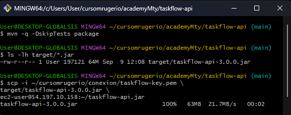

La salida muestra que `taskflow-api-3.0.0.jar` fue generado correctamente y que la transferencia hacia EC2 terminó al **100 %**.

---

### MP-7 - Primer arranque público

#### Qué hice

Dentro de EC2 inicié TaskFlow en segundo plano con `nohup`:

```bash
nohup java -jar taskflow-api.jar > app.log 2>&1 &
```

Después revisé el log de la aplicación y accedí desde mi computadora al Swagger publicado en el puerto `8080`.

Una vez dentro de Swagger inicié sesión con un usuario de prueba, autoricé las peticiones mediante JWT y ejecuté el endpoint de creación de tareas.

#### Para qué sirve

Este paso permitió comprobar que TaskFlow podía ejecutarse en una máquina EC2 y recibir peticiones desde internet a través del puerto `8080`.

#### Qué vi

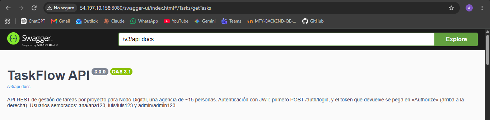

La captura muestra Swagger disponible desde mi navegador, confirmando que la API estaba ejecutándose públicamente desde EC2.

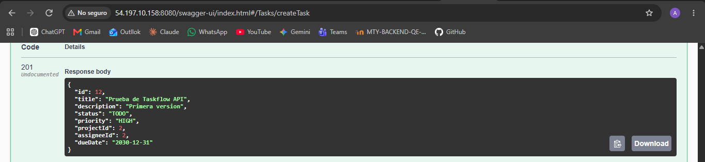

La petición de creación respondió con código HTTP **201** y devolvió los datos de la nueva tarea. Esto confirmó que la API no solamente cargaba, sino que podía procesar operaciones correctamente.

---

## 3. RDS y la red

### MP-8 - Crear RDS

#### Qué hice

Creé una base de datos administrada en Amazon RDS llamada `taskflow-db` utilizando el motor **PostgreSQL**.

La instancia de base de datos quedó en estado `Available`.

#### Para qué sirve

Amazon RDS permite utilizar una base de datos administrada por AWS. En lugar de instalar PostgreSQL manualmente dentro de EC2, la base se ejecuta como un recurso independiente.

Esto separa la aplicación de la persistencia de datos y permite que EC2 se concentre en ejecutar TaskFlow.

#### Qué vi

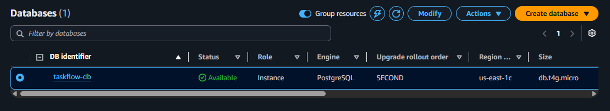

La captura muestra `taskflow-db` disponible y utilizando PostgreSQL.

---

### Conectividad entre EC2 y RDS

#### Qué hice

Después de crear RDS configuré TaskFlow para utilizar PostgreSQL como base de datos.

La aplicación se inició pasando la configuración necesaria mediante parámetros, utilizando valores protegidos para el host, usuario, contraseña y secreto JWT.

El flujo esperado era:

```text
EC2 / TaskFlow
      |
      | TCP 5432
      v
RDS / PostgreSQL
```

La base de datos no se configuró para recibir conexiones públicas desde internet. El acceso a PostgreSQL se limitó a la comunicación necesaria desde EC2 mediante la red de AWS y los Security Groups.

#### Problema encontrado

En el primer intento la aplicación no consiguió establecer la conexión con PostgreSQL y se presentó un timeout de conexión.

El error indicaba un problema de red entre EC2 y RDS, por lo que revisé la configuración de los Security Groups y el acceso al puerto `5432`.

Después de corregir la comunicación entre ambos recursos volví a iniciar TaskFlow.

#### Qué vi

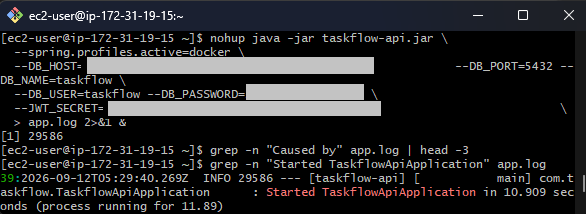

La evidencia muestra que `TaskflowApiApplication` completó correctamente su arranque después de realizar la configuración de RDS.

Con esto confirmé que la aplicación podía ejecutarse en EC2 utilizando la base PostgreSQL alojada en RDS.

> En el repositorio no se incluyen la contraseña de RDS, el `JWT_SECRET` ni el endpoint completo de la base de datos.

---

## 4. S3

### MP-9 - Bucket, JAR y presigned URL

#### Qué hice

Creé un bucket de Amazon S3 llamado `taskflow-artefactos-aarodriguezperez` para almacenar el artefacto generado de TaskFlow.

Después cargué el archivo:

```text
taskflow-api-3.0.0.jar
```

#### Para qué sirve

Amazon S3 permite almacenar objetos de forma duradera dentro de AWS. En esta práctica lo utilicé para mantener el artefacto compilado de TaskFlow fuera de la instancia EC2.

#### Qué vi

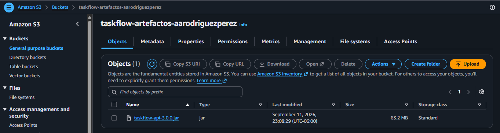

La captura muestra el archivo `taskflow-api-3.0.0.jar` almacenado correctamente dentro del bucket.

---

### Presigned URL

#### Qué hice

Generé desde Amazon S3 una **presigned URL** para el JAR.

#### Para qué sirve

Una presigned URL permite proporcionar acceso temporal a un objeto privado de S3 sin cambiar el bucket completo a acceso público.

De esta forma es posible compartir o descargar un archivo durante un periodo limitado manteniendo la configuración privada del bucket.

#### Qué vi

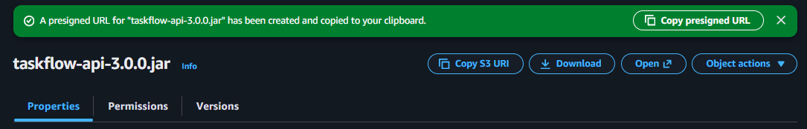

La consola de S3 confirmó que la URL prefirmada para `taskflow-api-3.0.0.jar` fue creada correctamente.

---

## 5. Integrador del Día 3

### TaskFlow funcionando en AWS

Al finalizar los bloques anteriores tenía los principales componentes de la práctica funcionando en AWS:

- **EC2** ejecutando TaskFlow con Java 21.
- Swagger disponible públicamente mediante el puerto `8080`.
- Autenticación JWT funcional.
- Creación de una tarea con respuesta HTTP `201`.
- **RDS PostgreSQL** utilizado como base de datos de la aplicación.
- **S3** almacenando el artefacto `taskflow-api-3.0.0.jar`.
- Presigned URL generada para acceso temporal al objeto de S3.

La topología utilizada se encuentra documentada en:

```text
infra/topologia-aws.md
```

---

### Smoke test

Como prueba funcional final accedí al Swagger desplegado en EC2, realicé la autenticación y ejecuté la creación de una tarea.

El código HTTP `201` mostrado en la evidencia `10-tarea-creada.png` confirmó que TaskFlow estaba disponible y procesando operaciones correctamente desde AWS.

---

### Limpieza de recursos

Al finalizar el Día 3 revisé los recursos creados para evitar consumo innecesario.

Los principales recursos a considerar durante la limpieza son:

- Instancia EC2 `taskflow-ec2`.
- Instancia RDS `taskflow-db`.
- Bucket y objetos de S3.
- Security Groups creados para la práctica.
- Recursos temporales que ya no sean necesarios.

No eliminé todavía los recursos que se reutilizarán durante las actividades del Día 4.

---

## Reflexiones del Día 3

### ¿Por qué RDS no tiene IP pública y cómo llega entonces EC2 a él?

RDS no necesita estar expuesto directamente a internet porque solamente TaskFlow necesita comunicarse con la base de datos.

EC2 y RDS se encuentran dentro de la infraestructura de red de AWS. TaskFlow utiliza el endpoint de RDS para realizar la conexión y el Security Group de la base permite tráfico PostgreSQL por el puerto `5432` desde la infraestructura autorizada de EC2.

Esto permite que la aplicación acceda a la base de datos sin abrir PostgreSQL al internet público.

---

### ¿Qué habría pasado si dejaba SSH abierto al mundo?

Si el puerto `22` hubiera quedado configurado con `0.0.0.0/0`, cualquier dirección de internet habría podido intentar establecer una conexión SSH con la instancia.

Aunque el acceso siguiera protegido mediante una llave, exponer SSH innecesariamente aumenta la superficie de ataque y permite intentos automatizados contra el servidor.

Por ese motivo configuré el puerto `22` únicamente para mi dirección IP y dejé público solamente el puerto `8080` necesario para probar Swagger durante esta práctica.
