# Actividades AWS - Semana 5

## Introducción

Durante la Semana 5 trabajé con AWS en dos etapas. En el **Día 3** desplegué TaskFlow manualmente usando EC2, RDS y S3. En el **Día 4** trabajé con DynamoDB y convertí ese despliegue manual en un flujo automatizado con CodePipeline, CodeBuild y CodeDeploy.

El documento resume qué hice, para qué sirvió cada bloque, qué resultados obtuve y los errores que encontré. No se incluyen contraseñas, Access Keys, `JWT_SECRET`, archivos `.pem` ni el endpoint completo de RDS.

---

# Día 3 - Fundamentos, EC2, S3, VPC y RDS

## 1. Presupuesto y seguridad

Antes de crear infraestructura configuré el presupuesto `taskflow-5usd` con un límite de **5 USD** para controlar el consumo de la práctica.


También utilicé un usuario IAM llamado `taskflow-admin` y configuré MFA para evitar trabajar diariamente con la cuenta principal.


Con esto dejé preparada una cuenta con control de gasto y una identidad separada para trabajar.

---


## 2. EC2

Creé la instancia `taskflow-ec2` de tipo `t3.micro`.


El Security Group se configuró con:

- SSH (`22`) únicamente desde mi IP.
- Puerto `8080` abierto para acceder públicamente a Swagger.

Después me conecté por SSH utilizando la llave privada de la instancia.


Dentro de EC2 comprobé que Java 21 estuviera disponible:

```bash
java -version
```


Generé el JAR de TaskFlow con Maven y lo transferí a EC2 mediante `scp`.


Finalmente inicié la aplicación con `nohup` y accedí a Swagger desde mi navegador.


Realicé login, autoricé las peticiones con JWT y creé una tarea. La API respondió con HTTP `201`.


Esto confirmó que TaskFlow estaba funcionando públicamente desde AWS.

---


## 3. RDS y red

Creé `taskflow-db` utilizando PostgreSQL en Amazon RDS.


Al intentar conectar TaskFlow con RDS inicialmente obtuve un timeout de conexión. El problema estaba relacionado con la comunicación de red entre EC2 y RDS.

Revisé los Security Groups y permití PostgreSQL por el puerto `5432` desde la infraestructura autorizada de EC2, sin hacer pública la base de datos.

Después de corregir la red, TaskFlow completó su arranque utilizando RDS.


Este error fue útil para entender que una base privada puede ser accesible desde EC2 sin exponer PostgreSQL a internet.

---


## 4. S3

Creé el bucket `taskflow-artefactos-aarodriguezperez` y subí:

```text
taskflow-api-3.0.0.jar
```


También generé una **presigned URL** para dar acceso temporal al objeto sin hacer público el bucket.


S3 quedó como almacenamiento externo para el artefacto de TaskFlow.

---


## 5. Integrador del Día 3

Al terminar el Día 3 tenía:

- EC2 ejecutando TaskFlow.
- Swagger público por el puerto `8080`.
- RDS PostgreSQL conectado desde EC2.
- S3 almacenando el JAR.
- Una presigned URL para acceso temporal.
- Un smoke test exitoso mediante la creación de una tarea.

La topología del Día 3 está documentada en:

```text
infra/topologia-aws.md
```

---


# Día 4 - DynamoDB, CodePipeline y CodeDeploy


## 6. Preparar nuevamente EC2

Volví a iniciar `taskflow-ec2` y añadí los dos elementos necesarios para CodeDeploy:

- Tag `Name = taskflow-ec2`.
- IAM instance profile `taskflow-ec2-role`.

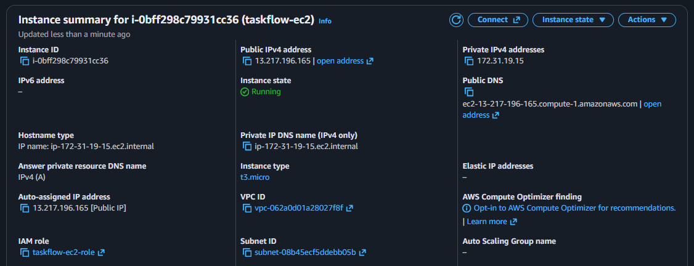

También eliminé el JAR copiado manualmente durante el Día 3. A partir de este punto el artefacto debía llegar mediante el pipeline.

---


## 7. DynamoDB


### Crear la tabla

Creé `taskflow-eventos` con:

- Partition key: `taskId`.
- Sort key: `fechaHora`.
- Capacity mode: On-demand.

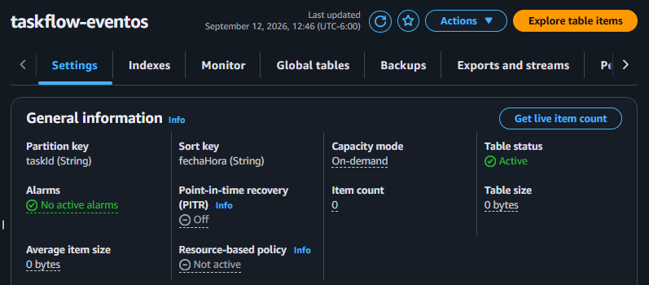

Después inserté cinco eventos mediante AWS CLI.

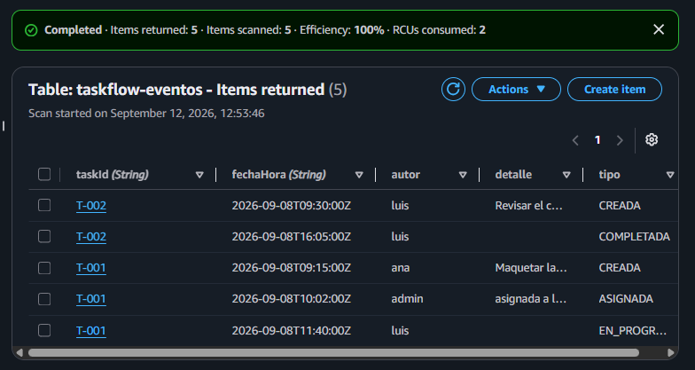

### Query vs Scan

Consulté los eventos de `T-001` con `Query` y con `Scan`.

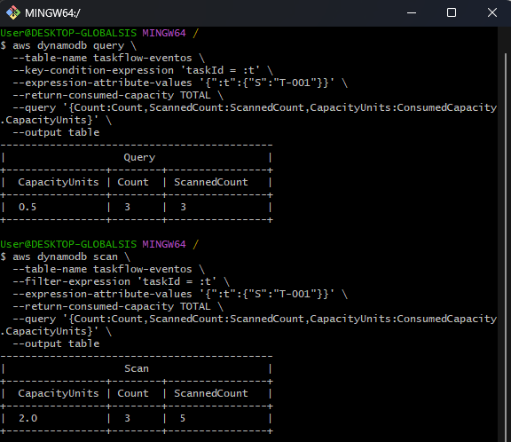


| Operación | Devueltos | Revisados | Capacity Units |
| --------- | --------- | --------- | -------------- |
| `Query`   | 3         | 3         | 0.5            |
| `Scan`    | 3         | 5         | 2.0            |


`Query` fue más eficiente porque utilizó directamente la partition key. `Scan` recorrió toda la tabla y después aplicó el filtro.

### Modelar al revés

Revisé los cuatro patrones de acceso de TaskFlow. El modelo actual funciona bien para consultar eventos por `taskId`, pero no resuelve eficientemente el patrón **“tareas que completó luis”**, porque `autor` y `tipo` no forman parte de la clave.

Para soportarlo correctamente sería necesario un **Global Secondary Index (GSI)**.

La idea principal es que en DynamoDB primero se definen las consultas que la aplicación necesita y después se diseña la tabla alrededor de esos patrones.

---


## 8. Bucket de artefactos e IAM para servicios

Reutilicé el bucket del Día 3 y activé **Bucket Versioning**.

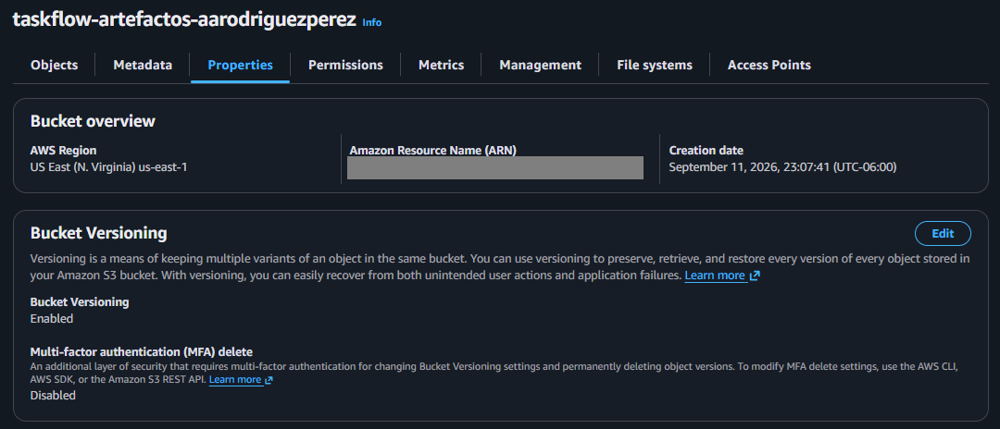

El bucket pasó de ser un ejercicio de almacenamiento a formar parte del pipeline como almacén de artefactos.

También verifiqué que EC2 tuviera asociado `taskflow-ec2-role`. Los roles de CodeDeploy, CodeBuild y CodePipeline se fueron creando conforme avancé.

---


## 9. CodeDeploy Agent

Instalé el agente de CodeDeploy en EC2 y validé su estado.

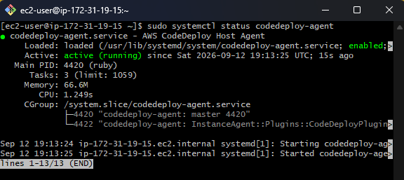

El estado `active (running)` confirmó que la instancia estaba lista para recibir despliegues automatizados.

---


## 10. taskflow.service

Agregué `taskflow.service` para reemplazar el uso de `nohup`.

Las directivas principales fueron:

```ini
User=ec2-user
WorkingDirectory=/opt/taskflow
ExecStart=/usr/bin/java -jar /opt/taskflow/taskflow-api.jar
SuccessExitStatus=143
Restart=always
```

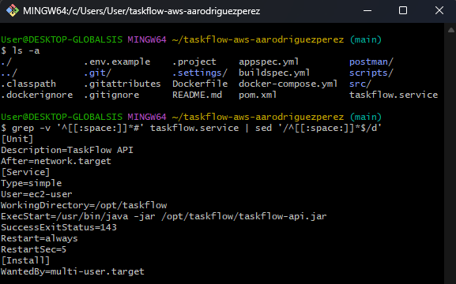

Con `systemd`, TaskFlow puede mantenerse como servicio y reiniciarse sin depender de una sesión SSH.

---


## 11. buildspec.yml

`buildspec.yml` define cómo CodeBuild genera el artefacto.

Las acciones principales son:

```bash
mvn -q -DskipTests package
mv target/taskflow-api-*.jar target/taskflow-api.jar
```

El artefacto incluye:

```text
target/taskflow-api.jar
appspec.yml
taskflow.service
scripts/**/*
```

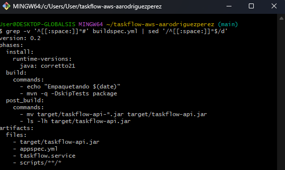

De esta forma CodeDeploy recibe no solo el JAR, sino también las instrucciones y scripts necesarios para instalarlo.

---


## 12. appspec.yml y hooks

Los comandos manuales del Día 3 quedaron automatizados mediante hooks:


| Acción manual    | Script         | Hook               |
| ---------------- | -------------- | ------------------ |
| Detener TaskFlow | `parar.sh`     | `ApplicationStop`  |
| Ajustar permisos | `permisos.sh`  | `AfterInstall`     |
| Iniciar TaskFlow | `arrancar.sh`  | `ApplicationStart` |
| Validar la API   | `verificar.sh` | `ValidateService`  |


Marqué los cuatro scripts como ejecutables dentro de Git.

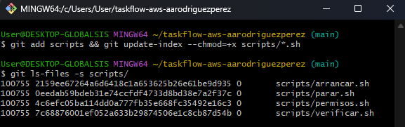

Las entradas `100755` confirman que el permiso de ejecución quedó registrado en el repositorio.

---


## 13. CodeDeploy y CodePipeline

Creé el rol `taskflow-codedeploy-role`, la aplicación `taskflow` y el deployment group `taskflow-dg`.

El deployment group utiliza:

```text
Name = taskflow-ec2
```

para identificar la instancia.

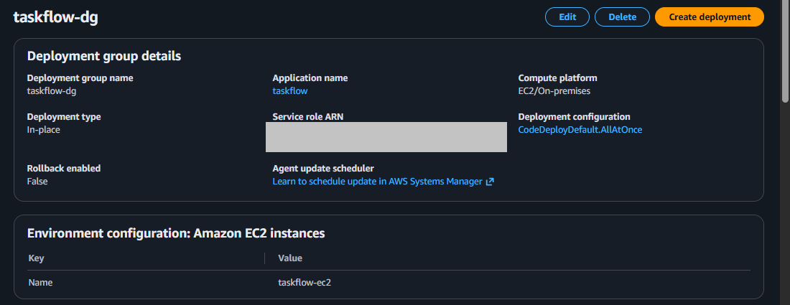

Después creé `taskflow-pipeline` con el flujo:

```text
GitHub -> CodeBuild -> CodeDeploy
```


### Primer error del pipeline

La primera ejecución llegó correctamente a Source, pero Build falló.

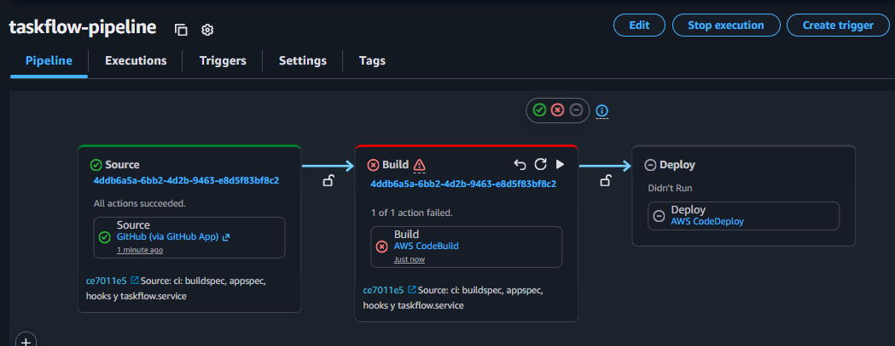

En los logs apareció:

```text
AccessDenied
s3:GetObject
```

El rol de CodeBuild no tenía permisos para descargar el artefacto desde mi bucket S3 personalizado.

Agregué el permiso requerido al rol `codebuild-taskflow-build-service-role` y repetí la etapa.

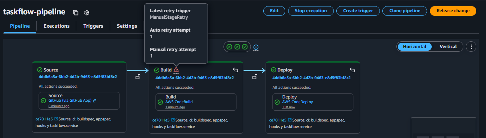

Después de la corrección, Source, Build y Deploy terminaron en verde.

---


## 14. Validar el despliegue

Abrí:

```text
http://<IP_PUBLICA_EC2>:8080/info
```

y obtuve:

```json
{
  "version": "3.0.0",
  "app": "taskflow-api"
}
```

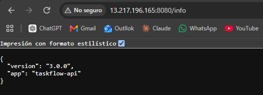

También comprobé:

```bash
systemctl status taskflow
```

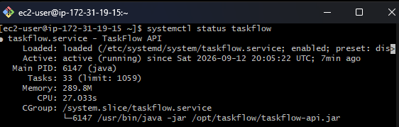

El estado `active (running)` confirmó que CodeDeploy instaló correctamente la aplicación y que ahora estaba administrada por `systemd`.

---


## 15. Integrador - El push que despliega


### Versión 3.0.1

Modifiqué la constante `VERSION` de `3.0.0` a `3.0.1` y realicé únicamente:

```bash
git add .
git commit -m "chore: v3.0.1"
git push
```

No compilé ni copié archivos manualmente.

Cuando terminó el pipeline, `/info` respondió:

```json
{
  "version": "3.0.1",
  "app": "taskflow-api"
}
```

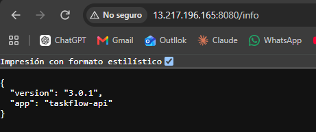

Esto confirmó que un push a `main` podía desplegar automáticamente una nueva versión.

---


## 16. Romper el pipeline a propósito

Cambié temporalmente en `appspec.yml`:

```text
scripts/permisos.sh
```

por:

```text
scripts/no-existe.sh
```

Después hice commit y push.

CodeDeploy falló en `AfterInstall` con:

```text
Error code: ScriptMissing
Script name: scripts/no-existe.sh
```

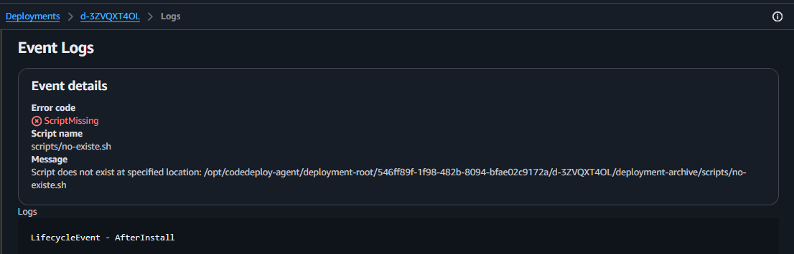

La prueba me permitió localizar exactamente qué hook falló y por qué.

Finalmente restauré `scripts/permisos.sh`, hice un nuevo push y el pipeline volvió a verde.

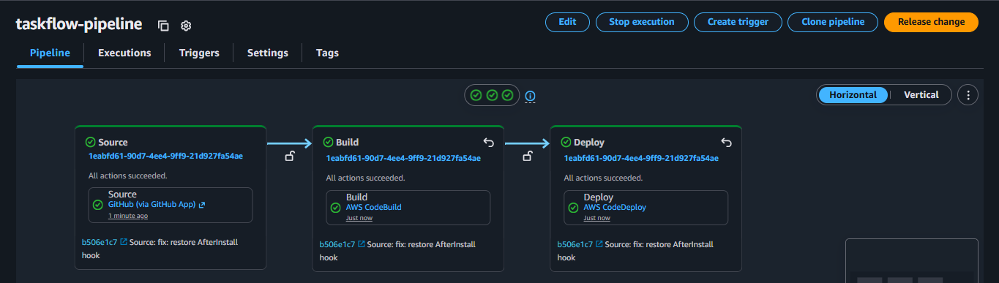

---


# Preguntas de reflexión


## 1. ¿Por qué RDS no tiene IP pública y cómo llega EC2 a él?

RDS no necesita estar expuesto a internet porque quien lo consume es TaskFlow desde EC2. Ambos recursos se comunican dentro de la red de AWS y el Security Group de RDS permite PostgreSQL por el puerto `5432` desde la infraestructura autorizada de EC2.

Así la base permanece privada y solamente la aplicación puede llegar a ella.

---


## 2. ¿Qué habría pasado si dejaba SSH abierto al mundo?

Con `0.0.0.0/0` en el puerto `22`, cualquier equipo en internet habría podido intentar conectarse por SSH.

Aunque la llave privada siguiera protegiendo el acceso, aumentaría innecesariamente la superficie de ataque. Por eso SSH quedó limitado a mi IP.

---


## 3. ¿Qué midió la comparación de Query contra Scan?

Medí cuántos elementos tuvo que revisar DynamoDB y cuánta capacidad consumió para devolver los mismos datos.

`Query` devolvió 3 elementos revisando 3 y consumiendo 0.5 unidades. `Scan` devolvió los mismos 3, pero revisó 5 y consumió 2.0 unidades.

La prueba mostró que `Query` es más eficiente cuando conocemos la partition key.

---


## 4. ¿Qué hace cada pieza del pipeline?

- **CodePipeline:** coordina Source, Build y Deploy.
- **CodeBuild:** lee `buildspec.yml`, compila TaskFlow y genera el artefacto.
- **S3:** almacena los artefactos que circulan entre las etapas.
- **CodeDeploy:** instala el artefacto en EC2 siguiendo `appspec.yml`.

`appspec.yml` viaja dentro del artefacto porque contiene las instrucciones de despliegue de esa revisión: archivos, rutas y hooks. Así el código y su forma de desplegarse permanecen versionados juntos.

---


## 5. ¿En qué hook vive cada comando manual del Día 3?


| Acción             | Script         | Hook               |
| ------------------ | -------------- | ------------------ |
| Detener aplicación | `parar.sh`     | `ApplicationStop`  |
| Ajustar permisos   | `permisos.sh`  | `AfterInstall`     |
| Iniciar aplicación | `arrancar.sh`  | `ApplicationStart` |
| Validar respuesta  | `verificar.sh` | `ValidateService`  |


El pipeline automatiza exactamente las tareas que antes ejecutaba manualmente y mantiene siempre el mismo orden.

---


# Limpieza

Al terminar las evidencias y el último push revise y eliminé los recursos:

- [x] `taskflow-pipeline`.
- [x] Proyecto CodeBuild `taskflow-build`.
- [x] Aplicación y deployment group de CodeDeploy.
- [x] Instancia EC2 `taskflow-ec2`.
- [x] RDS `taskflow-db`.
- [x] Bucket y artefactos de S3.
- [x] Roles IAM creados específicamente para la práctica.
- [x] Security Groups temporales.
- [x] Access Key creada para `taskflow-admin`.

Las casillas se deben marcar únicamente después de realizar la limpieza real en AWS.