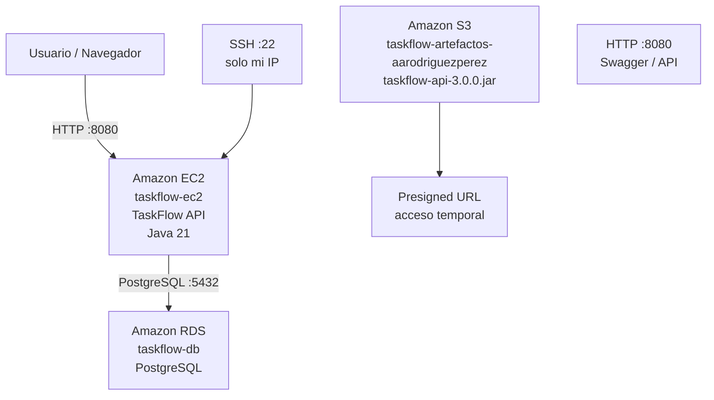

# Topología AWS - Día 3

## Descripción

Durante el Día 3 desplegué **TaskFlow** manualmente utilizando **Amazon EC2**, **Amazon RDS** y **Amazon S3**.

La aplicación se ejecuta en una instancia EC2, utiliza PostgreSQL alojado en RDS para la persistencia de información y mantiene el artefacto compilado en un bucket S3.

---

## Topología general



---

## Amazon EC2

La instancia:

```text
taskflow-ec2
```

funciona como servidor de la aplicación TaskFlow.

Dentro de EC2 se utilizó:

- Amazon Linux 2023.
- Java 21.
- El archivo `taskflow-api.jar`.
- Puerto `8080` para exponer Swagger y la API.

### Reglas principales de entrada

```text
SSH         TCP 22     Mi IP
Custom TCP  TCP 8080   0.0.0.0/0
```

El puerto SSH quedó limitado a mi dirección IP para evitar exponer el acceso administrativo a internet.

El puerto `8080` se dejó público de forma intencional durante la práctica para probar TaskFlow desde el navegador.

---

## Amazon RDS

La instancia:

```text
taskflow-db
```

aloja PostgreSQL.

TaskFlow se conecta desde EC2 hacia RDS utilizando:

```text
TCP 5432
```

RDS no necesita una IP pública porque la base de datos no debe ser consumida directamente desde internet.

La comunicación se realiza dentro de la red de AWS y el acceso se controla mediante Security Groups.

```text
taskflow-ec2
      |
      | TCP 5432
      v
taskflow-db
```

Esto permite mantener PostgreSQL aislado del acceso público.

---

## Amazon S3

El bucket:

```text
taskflow-artefactos-aarodriguezperez
```

almacena:

```text
taskflow-api-3.0.0.jar
```

S3 se utilizó como almacenamiento externo del artefacto de TaskFlow.

Además, generé una **presigned URL** para permitir acceso temporal al JAR sin hacer público el bucket completo.

---

## Flujo general

1. Desde mi computadora accedo a TaskFlow mediante la dirección pública de EC2 y el puerto `8080`.
2. TaskFlow se ejecuta con Java dentro de `taskflow-ec2`.
3. Cuando la aplicación necesita guardar o consultar información, se comunica con PostgreSQL en RDS por el puerto `5432`.
4. RDS permanece sin exposición pública directa.
5. El JAR también se almacena en S3.
6. Una presigned URL permite acceso temporal al objeto de S3.

---

## Resumen

La arquitectura del Día 3 representa un despliegue principalmente manual:

```text
Compilar JAR
    |
    v
Transferir por SCP
    |
    v
EC2 / TaskFlow
    |
    v
RDS PostgreSQL

S3
 |
 +-- taskflow-api-3.0.0.jar
 |
 +-- Presigned URL
```

Esta topología corresponde al estado de la infraestructura antes de automatizar el proceso en el Día 4 con CodePipeline, CodeBuild y CodeDeploy.
