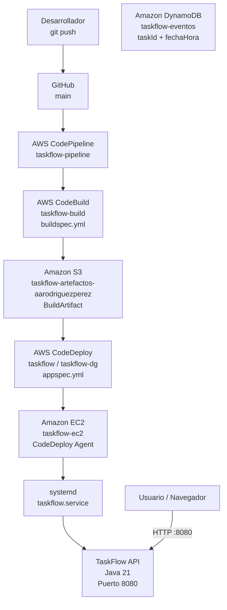

# Topología AWS - Día 4

## Descripción

Durante el Día 4 la arquitectura evolucionó de un despliegue manual a un flujo de **integración y despliegue continuo (CI/CD)**.

El código fuente se mantiene en GitHub. Cada `push` a la rama `main` activa CodePipeline, que coordina la compilación con CodeBuild y el despliegue con CodeDeploy sobre la instancia EC2.

DynamoDB se utilizó de forma independiente para practicar modelado NoSQL, inserción de eventos y comparación entre `Query` y `Scan`.

---

## Topología general



---

## Flujo del pipeline

```text
GitHub
   |
   | push a main
   v
CodePipeline
   |
   | SourceArtifact
   v
CodeBuild
   |
   | buildspec.yml
   | mvn package
   | genera taskflow-api.jar
   v
BuildArtifact
   |
   v
Amazon S3
   |
   v
CodeDeploy
   |
   | appspec.yml
   | hooks
   v
EC2
   |
   v
systemd
   |
   v
TaskFlow API
```

---

## GitHub

El repositorio contiene el código fuente y los archivos necesarios para automatizar el despliegue:

```text
buildspec.yml
appspec.yml
taskflow.service
scripts/
```

Un `push` a `main` inicia automáticamente el pipeline.

---

## CodePipeline

`taskflow-pipeline` actúa como orquestador del proceso.

Las etapas configuradas son:

```text
Source -> Build -> Deploy
```

- **Source:** obtiene el código desde GitHub.
- **Build:** llama a CodeBuild.
- **Deploy:** envía el artefacto generado a CodeDeploy.

---

## CodeBuild

El proyecto `taskflow-build` utiliza `buildspec.yml`.

Durante el build:

1. Usa Java 21 mediante Amazon Corretto.
2. Ejecuta Maven.
3. Genera el JAR.
4. Lo renombra a `taskflow-api.jar`.
5. Empaqueta también `appspec.yml`, `taskflow.service` y los scripts.

El resultado se entrega como `BuildArtifact`.

---

## Amazon S3

El bucket:

```text
taskflow-artefactos-aarodriguezperez
```

funciona como almacén de artefactos del pipeline.

Durante el Día 4 se habilitó **Bucket Versioning**.

CodePipeline y CodeBuild utilizan este bucket para almacenar y transferir los artefactos entre etapas.

---

## CodeDeploy

La aplicación de CodeDeploy se configuró como:

```text
Application: taskflow
Deployment group: taskflow-dg
Deployment type: In-place
```

La instancia objetivo se identifica mediante el tag:

```text
Name = taskflow-ec2
```

CodeDeploy utiliza `appspec.yml` para ejecutar los lifecycle hooks.

| Hook | Script | Función |
| --- | --- | --- |
| `ApplicationStop` | `parar.sh` | Detener TaskFlow |
| `AfterInstall` | `permisos.sh` | Ajustar permisos |
| `ApplicationStart` | `arrancar.sh` | Iniciar TaskFlow |
| `ValidateService` | `verificar.sh` | Validar `/info` |

---

## Amazon EC2

La instancia:

```text
taskflow-ec2
```

recibe el despliegue mediante CodeDeploy.

Tiene asociado:

```text
IAM Role: taskflow-ec2-role
```

y ejecuta el agente de CodeDeploy.

La aplicación ya no se inicia mediante `nohup`; se administra como servicio mediante `systemd`.

---

## systemd y TaskFlow

El servicio:

```text
taskflow.service
```

ejecuta:

```text
/usr/bin/java -jar /opt/taskflow/taskflow-api.jar
```

Esto permite que TaskFlow:

- no dependa de una sesión SSH;
- pueda reiniciarse automáticamente;
- se administre como servicio del sistema.

La API se expone mediante:

```text
HTTP :8080
```

---

## DynamoDB

La tabla utilizada durante el Día 4 fue:

```text
taskflow-eventos
```

con:

```text
Partition key: taskId
Sort key: fechaHora
```

DynamoDB se utilizó para practicar:

- inserción y lectura de eventos;
- `Query` contra `Scan`;
- modelado basado en patrones de acceso;
- identificación de un caso que requeriría un Global Secondary Index.

DynamoDB forma parte de las actividades del Día 4, aunque no participa directamente en el pipeline de despliegue de TaskFlow.

---

## IAM para servicios

Cada componente utiliza un rol distinto:

| Rol | Servicio |
| --- | --- |
| `taskflow-ec2-role` | EC2 |
| `taskflow-codedeploy-role` | CodeDeploy |
| `codebuild-taskflow-build-service-role` | CodeBuild |
| `AWSCodePipelineServiceRole-...` | CodePipeline |

Esto permite que los servicios trabajen con permisos propios sin utilizar las credenciales del usuario IAM.

---

## Resumen

La principal diferencia respecto al Día 3 es que el despliegue dejó de depender de comandos manuales.

```text
Día 3
Compilar -> SCP -> SSH -> nohup -> comprobar

Día 4
git push -> CodePipeline -> CodeBuild -> S3 -> CodeDeploy -> systemd
```

El resultado fue un flujo en el que un cambio enviado a `main` podía compilarse y desplegarse automáticamente hasta la instancia EC2.
