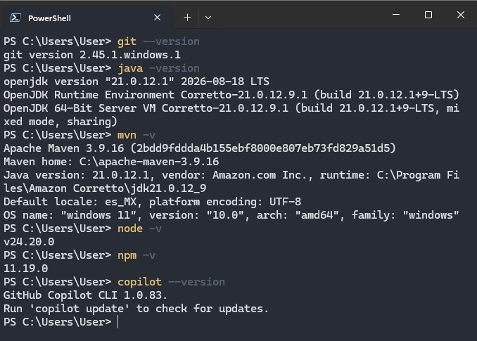
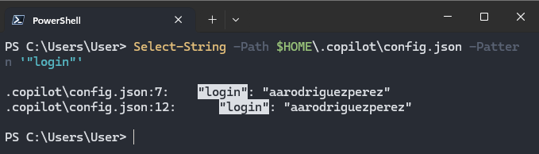
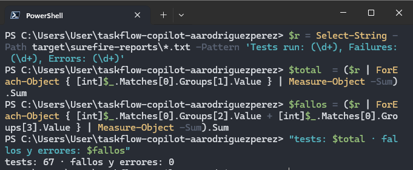
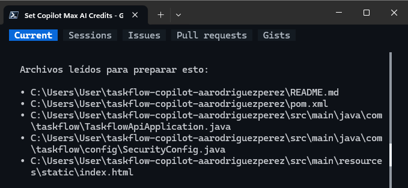
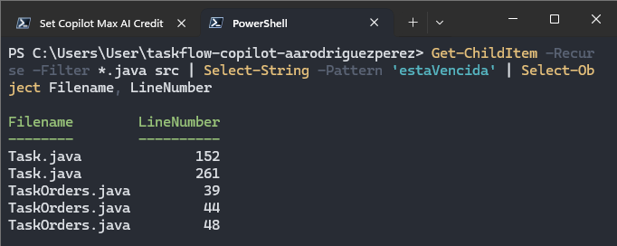
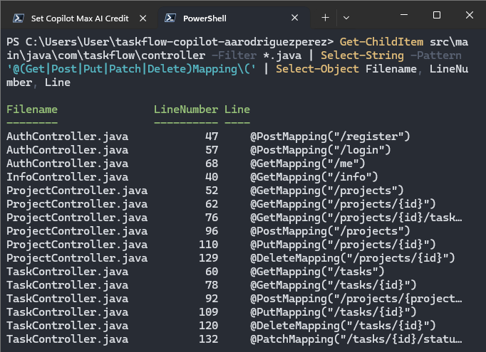
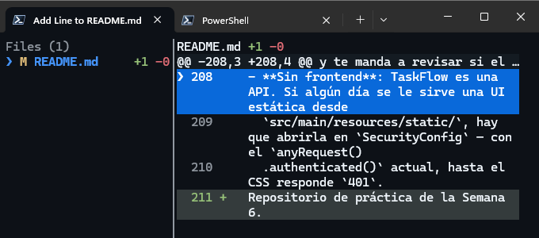
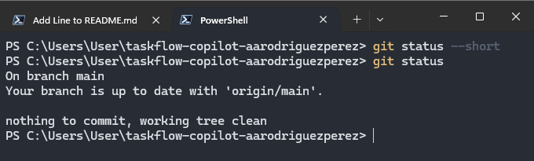
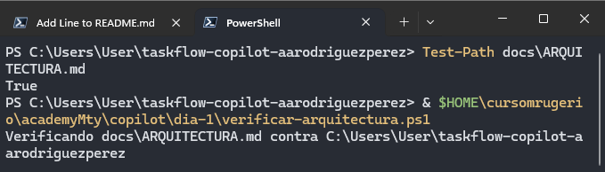
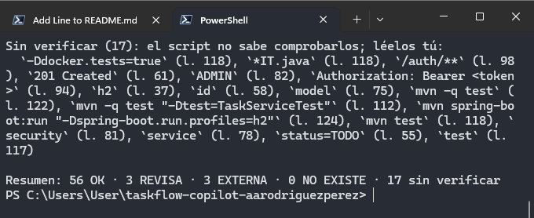

# Día 01 - GitHub Copilot CLI, verificación y control del agente

## Objetivo

Durante el primer día se preparó el entorno de trabajo para utilizar **GitHub Copilot CLI** sobre el proyecto **TaskFlow API**.  
El objetivo principal fue aprender a trabajar con el agente de forma controlada: consultar el repositorio, comprobar sus respuestas con comandos independientes, administrar permisos, deshacer cambios y generar documentación técnica validada.

El trabajo se realizó sobre el repositorio:

`taskflow-copilot-aarodriguezperez`

---

## 1. Preparación del entorno

Se configuró **PowerShell 7** como terminal principal para trabajar con GitHub Copilot CLI.

La versión utilizada fue:

```text
PowerShell 7.6.6
```

La comprobación de versión devolvió correctamente la versión mayor `7`.


También se validaron las herramientas requeridas para la actividad:

| Herramienta | Versión utilizada |
| --- | --- |
| Git | 2.45.1 |
| Java | 21.0.12.1 |
| Maven | 3.9.16 |
| Node.js | v24.20.0 |
| npm | 11.19.0 |
| GitHub Copilot CLI | 1.0.83 |



Después se inició sesión en GitHub Copilot CLI y se verificó que la configuración correspondiera al usuario `aarodriguezperez`.



---

## 2. Preparación del repositorio TaskFlow

Se trabajó con una copia independiente de **TaskFlow API** para evitar modificar directamente el repositorio base de la academia.

El repositorio quedó conectado con GitHub y con la rama `main` sincronizada con `origin/main`.


Como línea base se ejecutó la suite de pruebas del proyecto.

El resultado fue:

```text
tests: 67
fallos y errores: 0
```

Esto confirmó que el proyecto se encontraba estable antes de empezar a trabajar con el agente.



---

## 3. Configuración del modelo

Se configuró GitHub Copilot CLI para utilizar **GPT-5 mini** durante las prácticas.

En el selector de modelos se verificó que `GPT-5 mini` apareciera como el modelo activo.


El propósito de fijar el modelo fue mantener un consumo controlado de créditos y evitar cambios inesperados de modelo entre sesiones.

---

## 4. Consulta y verificación del repositorio

Una parte importante del ejercicio consistió en comprobar que las respuestas del agente coincidieran con el contenido real del repositorio.

### 4.1 Explicación general del proyecto

Se pidió a Copilot explicar:

- qué hace la aplicación;
- qué tecnologías utiliza;
- cómo está organizado el código;
- qué archivos había consultado para generar la respuesta.

Copilot generó un resumen del proyecto y describió la arquitectura general de TaskFlow.


También indicó los archivos que utilizó como fuente para construir la respuesta.



La información se comprobó posteriormente desde PowerShell.

Se verificaron los paquetes existentes dentro de:

```text
src/main/java/com/taskflow
```

Los diez paquetes encontrados fueron:

```text
advice
config
controller
dto
exception
mapper
model
repository
security
service
```

También se comprobó con `Test-Path` que los archivos citados por el agente existieran realmente.


---

### 4.2 Regla de tareas vencidas

Se preguntó a Copilot dónde se encontraba la regla que determina si una tarea está vencida.

El agente identificó el método:

```java
Task.estaVencida()
```

y señaló otros puntos donde se utiliza.


Después se realizó una búsqueda independiente con PowerShell.

Las apariciones relevantes se localizaron en:

```text
Task.java
TaskOrders.java
```

La búsqueda permitió comprobar las líneas reales donde aparece `estaVencida`.



---

### 4.3 Validación de endpoints

También se preguntó si existía un endpoint específico para obtener tareas vencidas.

Copilot indicó que en ese momento **no existía un endpoint dedicado** para esa funcionalidad.


La respuesta se verificó buscando todas las anotaciones de endpoints dentro de los controladores.

La búsqueda confirmó que no existía todavía:

```text
GET /tasks/overdue
```



Este ejercicio permitió reforzar una regla importante de trabajo con agentes:

> Una respuesta del modelo debe comprobarse con una fuente independiente cuando el resultado sea verificable.

---

## 5. Control de permisos del agente

Se realizaron ejercicios para revisar qué acciones intenta ejecutar Copilot antes de permitirlas.

### 5.1 Ejecución de pruebas

Se pidió al agente ejecutar:

```text
mvn -q test
```

El comando fue revisado antes de aprobarse y la ejecución terminó correctamente.

Posteriormente se pidió al agente borrar la carpeta `target`.

La operación fue rechazada y se indicó explícitamente que no debía borrar nada.


Después se comprobó manualmente que la carpeta continuara existiendo:

```powershell
Test-Path target
```

Resultado:

```text
True
```


La práctica mostró la importancia de leer el comando propuesto por el agente antes de autorizarlo.

---

## 6. Uso de `/diff` y `/rewind`

Se permitió temporalmente que Copilot agregara una línea al archivo `README.md`.

Con:

```text
/diff
```

se revisó visualmente el cambio antes de continuar.



Posteriormente se utilizó:

```text
/rewind
```

seleccionando:

```text
Conversation + files
```

para regresar tanto la conversación como los archivos al estado anterior.


Finalmente se comprobó con Git que el repositorio había quedado limpio:

```text
nothing to commit, working tree clean
```



---

## 7. Instrucciones de Copilot para el proyecto

Se configuró el archivo:

```text
.github/copilot-instructions.md
```

con las reglas proporcionadas para el proyecto TaskFlow.

Estas instrucciones permiten definir criterios permanentes para el agente, entre ellos:

- responder y comentar en español;
- no modificar archivos que no fueron solicitados;
- no cambiar tests existentes únicamente para hacerlos pasar;
- no realizar `git commit` o `git push` sin autorización;
- no afirmar resultados que no hayan sido verificados;
- evitar escribir secretos.

La carga del archivo se comprobó desde `/instructions`, donde apareció como instrucción activa del repositorio.


---

## 8. Integrador: documentación de arquitectura

Como ejercicio integrador se pidió a Copilot generar:

```text
docs/ARQUITECTURA.md
```

El documento debía explicar:

- capas y paquetes del proyecto;
- recorrido de `POST /projects/{projectId}/tasks`;
- reglas de negocio;
- seguridad con JWT;
- organización de pruebas.

Se comprobó primero que el archivo existiera correctamente.



Después se utilizó el script independiente:

```text
verificar-arquitectura.ps1
```

para comprobar las clases, métodos, archivos y endpoints mencionados por el agente.

El resultado final fue:

```text
Resumen: 56 OK · 3 REVISA · 3 EXTERNA · 0 NO EXISTE · 17 sin verificar
```

El punto más importante fue:

```text
0 NO EXISTE
```

lo que confirmó que el documento final no contenía referencias a clases, métodos, rutas o endpoints inexistentes dentro de lo que el verificador podía comprobar.



La práctica también mostró que `0 NO EXISTE` no significa que todo el contenido sea automáticamente correcto: las relaciones entre componentes todavía requieren lectura y validación contra el código.

---

## 9. Evidencia final

Al terminar el integrador se generaron los archivos de evidencia del Día 01:

```text
evidencia/dia1/
├── copilot-version.txt
├── usage.txt
├── uso-integrador.json
└── verificador.txt
```

El consumo registrado para el integrador fue:

```text
AI Credits del integrador: 10.85
modelo: gpt-5-mini
```

La versión registrada de GitHub Copilot CLI fue:

```text
GitHub Copilot CLI 1.0.83
```

Finalmente se comprobó que la rama `main` estuviera sincronizada con GitHub y que el repositorio quedara limpio:

```text
nothing to commit, working tree clean
```


---

## Resultados del Día 01

Al finalizar el día se logró:

- Configurar PowerShell 7 y GitHub Copilot CLI.
- Validar el entorno de Java, Maven, Node.js, npm y Git.
- Trabajar sobre un repositorio independiente de TaskFlow.
- Confirmar una línea base de **67 tests con 0 fallos**.
- Configurar **GPT-5 mini** como modelo de trabajo.
- Consultar el repositorio con Copilot y verificar sus respuestas de forma independiente.
- Identificar y comprobar la regla `Task.estaVencida()`.
- Confirmar que inicialmente no existía `GET /tasks/overdue`.
- Practicar aprobación y rechazo de acciones del agente.
- Utilizar `/diff` para revisar cambios.
- Utilizar `/rewind` con **Conversation + files** para restaurar archivos.
- Configurar `.github/copilot-instructions.md`.
- Generar `docs/ARQUITECTURA.md`.
- Validar la documentación con **0 referencias inexistentes**.
- Registrar el consumo y las evidencias del ejercicio.

---

## Conclusión

El primer día estuvo enfocado en comprender que GitHub Copilot CLI no debe utilizarse únicamente como generador de respuestas, sino como un **agente cuyos resultados y acciones deben ser revisados**.

Las principales prácticas aplicadas fueron:

1. verificar las afirmaciones del agente con comandos independientes;
2. revisar los permisos antes de ejecutar acciones;
3. utilizar Git para comprobar el estado real de los archivos;
4. limitar el comportamiento del agente mediante instrucciones del proyecto;
5. validar la documentación generada con herramientas externas al modelo.

Estas prácticas sirven como base para los siguientes días, donde Copilot comienza a modificar código, implementar especificaciones y trabajar con herramientas MCP.
