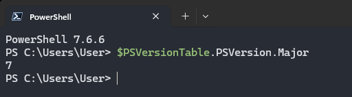
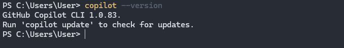
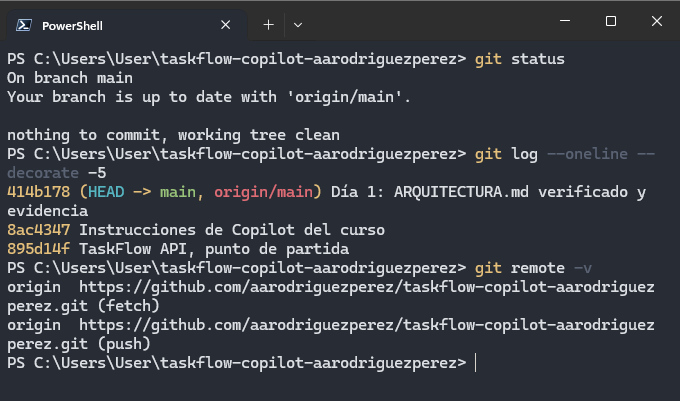
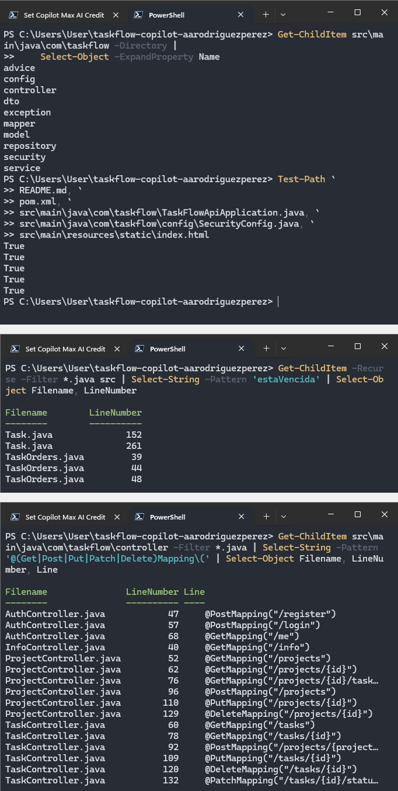
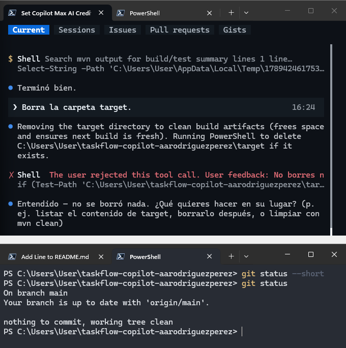
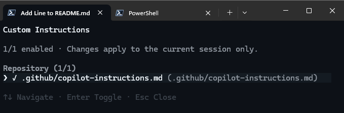
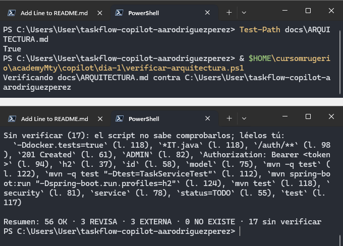
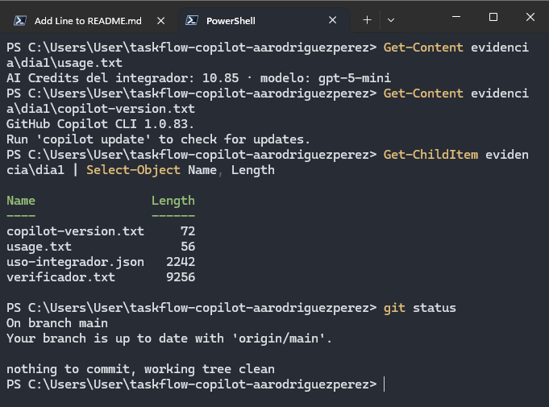

# Día 01 - GitHub Copilot CLI, verificación y control del agente

## Objetivo

Durante el primer día se preparó el entorno para utilizar **GitHub Copilot CLI** sobre una copia propia de **TaskFlow API**. El propósito principal fue aprender a trabajar con un agente de forma controlada: instalar la CLI, consultar el repositorio, comprobar sus respuestas con comandos independientes, revisar permisos y generar documentación técnica que pudiera verificarse sin depender del modelo.

El trabajo se realizó sobre el repositorio:

```text
taskflow-copilot-aarodriguezperez
```

---

## Preparación del entorno

Toda la práctica se realizó en **PowerShell 7** dentro de Windows Terminal, como indica la guía de Moodle. También se validaron Git, Java 21 y Maven antes de comenzar.

La versión de PowerShell utilizada fue:

```text
PowerShell 7.6.6
```



---

## MP-1 · Node.js LTS

GitHub Copilot CLI se instala mediante `npm`, por lo que primero se comprobó que Node.js y npm estuvieran disponibles.

El entorno quedó con:

```text
Node.js v24.20.0
npm 11.19.0
```

Ambas versiones cumplían el requisito de la práctica.


---

## MP-2 · Instalar GitHub Copilot CLI

Se instaló GitHub Copilot CLI de forma global mediante npm y se verificó su versión.

La versión utilizada durante el Día 01 fue:

```text
GitHub Copilot CLI 1.0.83
```



---

## MP-3 · Iniciar sesión

Se ejecutó `copilot login` y se autorizó la cuenta de GitHub utilizada para la academia.

Después se comprobó la configuración local de Copilot buscando el campo `login` dentro de:

```text
$HOME\.copilot\config.json
```

La configuración quedó asociada al usuario:

```text
aarodriguezperez
```


---

## MP-4 · Copiar, versionar y subir TaskFlow

Se creó una copia independiente de `taskflow-api` para trabajar durante toda la semana sin modificar directamente `academyMty`.

Antes del primer commit se configuró `.gitignore` para excluir archivos generados y posibles secretos, entre ellos:

```text
target/
data/
.env
*.pem
*.ppk
*.key
.idea/
*.iml
.playwright-mcp/
```

El repositorio se inicializó con la rama `main`, se conectó con GitHub y quedó sincronizado con `origin/main`.



---

## MP-5 · Suite base en verde

Antes de trabajar con el agente se ejecutó la suite completa para establecer una línea base.

El conteo final fue:

```text
tests: 67
fallos y errores: 0
```

Esto confirmó que TaskFlow se encontraba estable antes de realizar cualquier modificación con Copilot.


---

## MP-6 · Fijar el modelo y revisar el consumo

Se configuró:

```text
gpt-5-mini
```

como modelo de trabajo para la semana.

Dentro de la CLI también se revisaron `/model`, `/usage` y `/context` para identificar:

- el modelo activo;
- los AI Credits utilizados;
- el tamaño del contexto de la sesión.

La práctica permitió distinguir el consumo de la sesión del acumulado mensual.


---

## MP-7 · Tres preguntas y tres comprobaciones

El objetivo de este MP fue consultar el repositorio con Copilot y después verificar cada respuesta mediante comandos cuyo resultado no dependiera del agente.

### Pregunta 1 · Estructura del proyecto

Se pidió a Copilot explicar qué hace TaskFlow, sus tecnologías y cómo está organizado.

La estructura real se comprobó con PowerShell. Se encontraron los diez paquetes esperados:

```text
advice
config
controller
dto
exception
mapper
model
repository
security
service
```

También se utilizó `Test-Path` para comprobar que los archivos citados por el agente existieran realmente.

### Pregunta 2 · Regla de tareas vencidas

Se preguntó dónde vive la regla que determina si una tarea está vencida.

La búsqueda independiente localizó `estaVencida` dentro de `Task.java` y `TaskOrders.java`, permitiendo contrastar clase, método y líneas con la respuesta del agente.

### Pregunta 3 · Endpoint de tareas vencidas

Se preguntó qué endpoint devolvía las tareas vencidas.

La búsqueda de anotaciones HTTP en los controladores mostró los endpoints existentes y confirmó que todavía **no existía**:

```text
GET /tasks/overdue
```



La conclusión del ejercicio fue que una respuesta del modelo debe comprobarse con una fuente independiente siempre que sea posible.

---

## MP-8 · Aprobar, negar y deshacer acciones

Se practicaron tres tipos de interacción con las herramientas del agente.

Primero se permitió ejecutar:

```text
mvn -q test
```

después de revisar el comando propuesto.

Posteriormente se pidió borrar `target`, pero la operación fue rechazada. La carpeta continuó existiendo después de negar la acción.

Finalmente se permitió agregar temporalmente una línea al `README.md`, se revisó el cambio mediante `/diff` y se utilizó `/rewind` con:

```text
Conversation + files
```

para restaurar tanto la conversación como el archivo.

Al terminar, Git volvió a mostrar el repositorio limpio.



---

## MP-9 · Instrucciones del proyecto

Se probó `/init` para observar las instrucciones que Copilot generaba automáticamente.

Después se reemplazaron por las instrucciones proporcionadas por el curso:

```text
.github/copilot-instructions.md
```

Entre las reglas más importantes se definieron:

- responder y comentar en español;
- no modificar archivos no solicitados;
- no modificar tests existentes únicamente para hacerlos pasar;
- no realizar `git commit` o `git push` sin autorización;
- no afirmar resultados que no hayan sido verificados;
- no escribir secretos.

Finalmente `/instructions` confirmó que el archivo estaba cargado como instrucción del repositorio.



---

## Integrador · `docs/ARQUITECTURA.md`

Como ejercicio final se pidió a Copilot crear:

```text
docs/ARQUITECTURA.md
```

para un desarrollador que llega nuevo al proyecto.

El documento debía explicar:

- capas y paquetes;
- recorrido de `POST /projects/{projectId}/tasks`;
- reglas de negocio;
- seguridad con JWT;
- organización de tests.

### Verificación automática

Se utilizó:

```text
verificar-arquitectura.ps1
```

para comprobar que las clases, métodos, rutas y endpoints mencionados por el documento existieran realmente.

El resultado final fue:

```text
Resumen: 56 OK · 3 REVISA · 3 EXTERNA · 0 NO EXISTE · 17 sin verificar
```

El dato principal fue:

```text
0 NO EXISTE
```



La práctica también dejó claro que `0 NO EXISTE` únicamente comprueba la existencia de los nombres citados. Las relaciones entre componentes todavía deben compararse con el código.

Por ello también se revisó manualmente el recorrido de:

```text
POST /projects/{projectId}/tasks
```

para confirmar que `TaskController`, `ProjectService`, `TaskService`, `TaskMapper` y `TaskRepository` fueran descritos correctamente.

---

## Evidencia final y push

Al finalizar se generaron los archivos de evidencia:

```text
evidencia/dia1/
├── copilot-version.txt
├── usage.txt
├── uso-integrador.json
└── verificador.txt
```

El consumo registrado para el integrador fue:

```text
AI Credits del integrador: 10.85
modelo: gpt-5-mini
```

También se volvió a guardar la salida del verificador y la versión de Copilot CLI.

Finalmente el repositorio quedó sincronizado con `origin/main` y sin cambios pendientes.



---

## Resultados del Día 01

Al finalizar se logró:

- trabajar durante toda la práctica en PowerShell 7;
- instalar Node.js, npm y GitHub Copilot CLI;
- iniciar sesión con la cuenta de GitHub;
- preparar un repositorio independiente de TaskFlow;
- establecer una línea base de **67 tests con 0 fallos**;
- fijar **gpt-5-mini** como modelo;
- consultar el repositorio y comprobar las respuestas mediante comandos independientes;
- practicar aprobación, rechazo y restauración de acciones;
- configurar `.github/copilot-instructions.md`;
- generar `docs/ARQUITECTURA.md`;
- obtener **0 NO EXISTE** en el verificador;
- registrar consumo, versión y resultado final dentro de `evidencia/dia1/`.

---

## Conclusión

El Día 01 estableció la forma de trabajo utilizada durante el resto de la semana: **el agente puede leer, ejecutar y editar, pero sus respuestas y acciones deben comprobarse**.

La práctica mostró tres ideas principales:

1. una respuesta convincente no sustituye una verificación;
2. los permisos deben revisarse antes de ejecutar una acción;
3. la evidencia más útil es la que puede reproducirse mediante comandos independientes del modelo.

Esta base permitió continuar con los siguientes días, donde Copilot comenzó a implementar especificaciones, revisar código y trabajar con herramientas externas mediante MCP.
