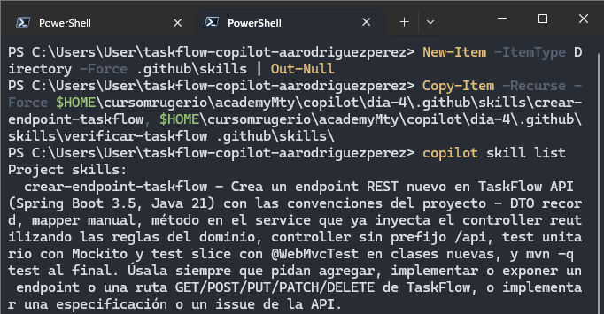
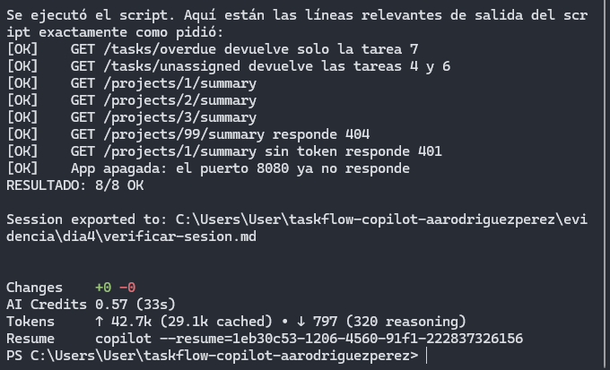
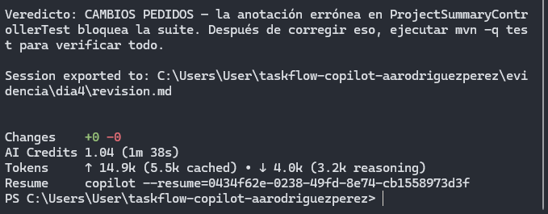
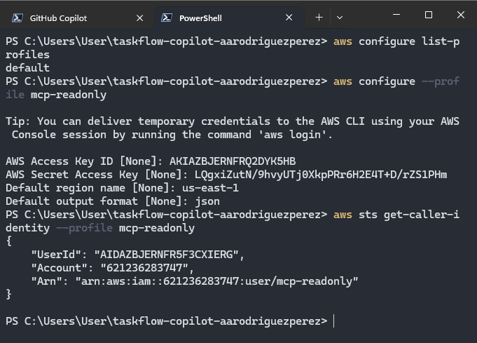
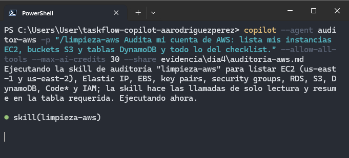
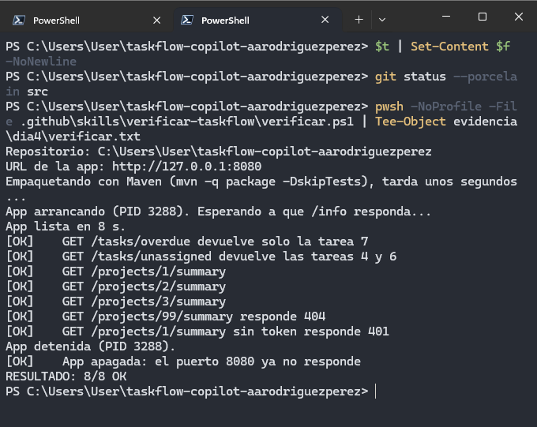

# Día 04 - Skills, agentes personalizados y auditoría controlada

## Objetivo

Durante el Día 04 se trabajó con **skills**, **agentes personalizados** y servidores **MCP** para organizar el trabajo de GitHub Copilot CLI por responsabilidades.

Los objetivos principales de la práctica fueron:

- implementar el endpoint `GET /projects/{id}/summary` utilizando una skill del proyecto;
- validar la implementación mediante una segunda skill de verificación;
- separar responsabilidades de revisión y testing mediante agentes personalizados;
- auditar una cuenta de AWS con un agente restringido por permisos de solo lectura;
- comprobar, mediante una prueba integradora, que la verificación real detecta errores de negocio.

La práctica se realizó sobre la rama:

```text
 dia4-equipo
```

en el repositorio:

```text
 taskflow-copilot-aarodriguezperez
```

---

## MP-1 · Agregar las skills al proyecto

Se incorporaron al repositorio las siguientes skills:

```text
.github/skills/crear-endpoint-taskflow/
.github/skills/verificar-taskflow/
```

La primera se utiliza para implementar endpoints REST dentro de TaskFlow respetando la estructura del proyecto. La segunda ejecuta un script de verificación de punta a punta para comprobar que la aplicación responde correctamente.

Con `copilot skill list` se comprobó que ambas skills ya aparecían como **Project skills**.



---

## MP-2 · Romper y restaurar el frontmatter de una skill

Para entender cómo detecta Copilot una skill, se editó temporalmente el archivo:

```text
.github/skills/verificar-taskflow/SKILL.md
```

Se eliminó la primera línea del frontmatter YAML y, como resultado, la skill dejó de cargar correctamente. Copilot reportó que el frontmatter estaba mal formado. Después se restauró el archivo original y se confirmó que la skill volviera a estar disponible.

Esto permitió comprobar que el encabezado YAML de `SKILL.md` es obligatorio para que Copilot reconozca la skill.


---

## MP-3 · Implementar `GET /projects/{id}/summary` con la skill

Se solicitó a Copilot implementar el endpoint a partir de `specs/summary.md`, usando explícitamente la skill:

```text
/crear-endpoint-taskflow
```

La implementación generó:

- controller;
- service;
- mapper;
- tests unitarios y slice en archivos nuevos;
- evidencia de la sesión.

Al finalizar, la suite pasó de **72** a **76 tests**, con resultado verde:

```text
Tests run: 76
Failures: 0
Errors: 0
Skipped: 0
BUILD SUCCESS
```


---

## MP-4 · Verificar que realmente se usó la skill

No bastaba con que el endpoint estuviera implementado: también había que demostrar que Copilot utilizó la skill correcta.

Para ello se revisó el transcript exportado de la sesión y se confirmó que la skill `crear-endpoint-taskflow` había sido cargada antes de generar el código.


---

## MP-5 · Ejecutar manualmente la skill `verificar-taskflow`

La skill `verificar-taskflow` incluye el script:

```text
.github/skills/verificar-taskflow/verificar.ps1
```

Este script empaqueta la aplicación, la arranca con H2, espera a que la API responda y valida distintos endpoints reales de TaskFlow.

Entre las comprobaciones realizadas estuvieron:

- `GET /tasks/overdue`;
- `GET /tasks/unassigned`;
- `GET /projects/1/summary`;
- `GET /projects/2/summary`;
- `GET /projects/3/summary`;
- `404` para proyecto inexistente;
- `401` sin token;
- apagado correcto de la aplicación.

El resultado fue:

```text
RESULTADO: 8/8 OK
```


---

## MP-6 · Ejecutar la verificación mediante Copilot

Después se pidió a Copilot ejecutar la misma comprobación usando la skill:

```text
/verificar-taskflow
```

En el transcript se verificó que el resultado también fue `8/8 OK` y que la ejecución terminó con código de salida correcto. Esto demuestra que el resultado no fue inventado por el modelo, sino producto de la ejecución real del script.



---

## MP-7 · Crear el equipo de agentes personalizados

Se agregaron al proyecto los siguientes agentes:

```text
.github/agents/revisor.agent.md
.github/agents/tester.agent.md
```

Al consultar `/agent`, Copilot mostró ambos agentes como parte del proyecto.

Sus responsabilidades quedaron separadas así:

- **revisor**: revisar la implementación sin modificar archivos;
- **tester**: agregar la cobertura faltante y ejecutar la suite.


---

## MP-8 · Revisar la implementación con el agente `revisor`

Se generó un diff con los cambios del endpoint y se pidió al agente `revisor` contrastarlo con `specs/summary.md`.

El agente devolvió:

- hallazgos;
- sugerencias;
- casos sin test;
- un veredicto sobre la calidad de la implementación.

Posteriormente se comprobó que no hubiera editado código dentro de `src`.



---

## MP-9 · Comprobar que el `revisor` no puede editar

Para validar la restricción del agente, se ejecutó una segunda prueba intentando que el `revisor` corrigiera directamente uno de sus hallazgos.

Aunque la sesión permitía muchas herramientas, el agente no pudo editar archivos porque en su definición solo contaba con herramientas de lectura y búsqueda.

Esto confirmó que el control real de permisos depende de la definición del agente y no únicamente de los flags de la sesión.


---

## MP-10 · Agregar los tests faltantes con el agente `tester`

El agente `tester` leyó:

- `specs/summary.md`;
- la sección **Casos sin test** de `evidencia/dia4/revision.md`;
- los tests existentes del endpoint.

Con base en eso agregó la cobertura faltante. Durante la revisión se detectaron algunos cambios innecesarios en un test existente; esos cambios se deshicieron y se conservó únicamente la nueva cobertura requerida.

La suite quedó finalmente en:

```text
Tests run: 77
Failures: 0
Errors: 0
Skipped: 0
BUILD SUCCESS
```


---

## MP-11 · Crear y configurar el perfil `mcp-readonly`

Para la parte de AWS se creó temporalmente el usuario y perfil:

```text
mcp-readonly
```

con permisos de solo lectura mediante `ViewOnlyAccess`.

El perfil se configuró localmente con `aws configure --profile mcp-readonly` y se verificó con `sts get-caller-identity`.

La Access Key y la Secret Access Key se usaron solo de forma local y no se integraron al repositorio ni a los prompts de la documentación final.



---

## MP-12 · Preparar el agente `auditor-aws` y la skill `limpieza-aws`

Se incorporaron:

```text
.github/agents/auditor-aws.agent.md
.github/skills/limpieza-aws/
```

Este agente utiliza el servidor MCP `aws-ro`, que se conecta mediante el perfil `mcp-readonly`. Su diseño estaba orientado a ejecutar únicamente lectura de recursos para listar el estado de la cuenta.

La sesión de auditoría cargó la skill y comenzó el proceso de lectura del script `auditoria.py`.



---

## MP-13 · Ejecutar la auditoría de AWS

Finalmente, el agente ejecutó la auditoría con una llamada basada en `aws___run_script` y generó el veredicto final sobre la cuenta.

El resultado reportado fue:

```text
Veredicto: CUENTA LIMPIA
```

Además, en una prueba controlada de escritura, AWS devolvió `AccessDenied` al intentar crear un bucket S3, comprobando que el usuario `mcp-readonly` efectivamente no contaba con permisos de escritura.


---

## Integrador · Provocar y detectar un bug real

Como parte final del Día 04 se introdujo intencionalmente un error en la lógica del resumen: se reemplazó temporalmente la validación correcta basada en `Task::estaVencida` por una condición que solo consideraba la fecha.

Esto provocó que tareas `DONE` con fecha pasada fueran contadas como vencidas. Al ejecutar nuevamente el verificador, el error fue detectado por la comprobación de punta a punta.

El resultado cambió a:

```text
RESULTADO: 2 de 8 con FALLA
```


Después se restauró la implementación correcta y se volvió a ejecutar la verificación. El sistema regresó a su estado esperado:

```text
RESULTADO: 8/8 OK
```



---

## Pull Request y merge

Una vez completada la práctica, se publicó la rama `dia4-equipo` y se abrió el Pull Request:

```text
#4 - GET /projects/{id}/summary con el equipo de .github
```

En el PR se integraron:

- las skills del proyecto;
- los agentes personalizados;
- la especificación `specs/summary.md`;
- la implementación del endpoint;
- los tests;
- la evidencia generada durante la práctica.

Después de revisar los cambios, el PR fue mergeado a `main`.


---

## Cierre del issue

La funcionalidad desarrollada correspondía al issue creado durante el Día 03:

```text
#2 - GET /projects/{id}/summary
```

Tras el merge del PR, el issue quedó asociado a la implementación y apareció como cerrado.


---

## Resultados del Día 04

Al finalizar la práctica se logró:

- incorporar skills reutilizables al proyecto;
- comprobar el efecto de un frontmatter inválido;
- implementar `GET /projects/{id}/summary` mediante una skill;
- demostrar en transcript que la skill fue realmente utilizada;
- aumentar la suite de **72 a 76 tests** durante la implementación;
- validar la aplicación con **8/8 OK** mediante el verificador;
- ejecutar esa misma validación a través de Copilot;
- crear y usar los agentes `revisor` y `tester`;
- obtener una revisión sin modificar código;
- comprobar que el `revisor` no podía editar archivos;
- ampliar la cobertura con el `tester` y finalizar con **77 tests** en verde;
- crear un perfil de AWS de solo lectura para auditoría;
- obtener el veredicto **CUENTA LIMPIA**;
- demostrar con `AccessDenied` que el perfil no podía crear buckets S3;
- provocar un bug intencional y detectarlo con la verificación real;
- restaurar la implementación y recuperar el resultado **8/8 OK**;
- integrar el trabajo mediante el PR `#4`;
- cerrar el issue `#2` asociado al endpoint.

---

## Conclusión

El Día 04 permitió pasar de un uso general de Copilot CLI a una organización más estructurada basada en:

- **skills** para encapsular recetas reutilizables;
- **agentes** para separar responsabilidades;
- **MCP** para acceder a herramientas y servicios externos;
- **scripts de verificación** para validar el comportamiento real de la aplicación.

También mostró que las restricciones más importantes no deben descansar únicamente en el modelo.

En el caso del agente `revisor`, la protección estuvo en las herramientas que tenía declaradas. En el caso de AWS, la protección efectiva estuvo en IAM mediante un perfil de solo lectura. Finalmente, la prueba integradora confirmó que la validación de punta a punta sigue siendo indispensable para detectar errores de negocio que una suite de tests puede pasar por alto.
