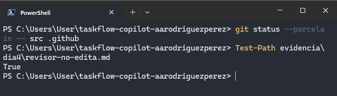
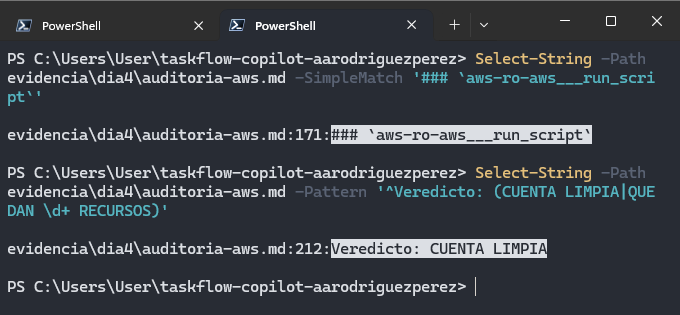
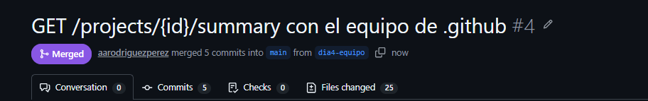

# Día 04 - Skills, agentes personalizados y auditoría controlada

## Objetivo

Durante el Día 04 se trabajó con dos mecanismos de GitHub Copilot CLI para estructurar mejor el trabajo del agente:

- **Skills**, utilizadas como recetas reutilizables para implementar y verificar funcionalidades.
- **Agentes personalizados**, utilizados para asignar responsabilidades y limitar herramientas según el rol.

La práctica se centró en implementar y validar:

```text
GET /projects/{id}/summary
```

Además, se utilizó un agente de solo lectura para auditar la cuenta de AWS y se comprobó que las restricciones de IAM impidieran operaciones de escritura.

El trabajo se realizó sobre:

```text
taskflow-copilot-aarodriguezperez
```

---

## 1. Implementación del endpoint mediante una skill

Se incorporó al repositorio la skill:

```text
.github/skills/crear-endpoint-taskflow/
```

La implementación se solicitó invocando explícitamente:

```text
/crear-endpoint-taskflow
```

El transcript confirmó que la skill fue cargada correctamente y que el agente siguió la receta definida para TaskFlow.


Como resultado se implementó:

```text
GET /projects/{id}/summary
```

La suite pasó de **72 a 76 tests**, con:

```text
Failures: 0
Errors: 0
Skipped: 0
BUILD SUCCESS
```

Los tests nuevos se agregaron en clases independientes, sin modificar los tests existentes.


---

## 2. Verificación de punta a punta

La skill:

```text
verificar-taskflow
```

incluye un script que arranca TaskFlow con H2, ejecuta verificaciones reales contra la aplicación y apaga el proceso al finalizar.

La comprobación incluyó:

- `GET /tasks/overdue`
- `GET /tasks/unassigned`
- los tres casos de `GET /projects/{id}/summary`
- respuesta `404`
- acceso sin token `401`
- apagado correcto de la aplicación

El resultado final fue:

```text
RESULTADO: 8/8 OK
```


Con esto se validó que la implementación no solo compilara y pasara tests con mocks, sino que funcionara correctamente con la aplicación ejecutándose.

---

## 3. Agente personalizado de revisión

Se agregó el agente:

```text
.github/agents/revisor.agent.md
```

Su función fue revisar la implementación y la especificación sin modificar archivos.

El agente reportó hallazgos y casos faltantes, mientras que la comprobación de Git confirmó que el proceso de revisión no modificó `src`.


Para comprobar que la restricción era real, se volvió a ejecutar el revisor con permisos amplios de sesión y se le pidió editar código.

Aun con:

```text
--allow-all-tools
```

el agente no pudo modificar archivos porque su lista de herramientas solo permitía lectura y búsqueda.



Esto demostró que la restricción efectiva se encontraba en la definición del agente y no únicamente en los permisos otorgados al iniciar la sesión.

---

## 4. Agente tester

También se incorporó:

```text
.github/agents/tester.agent.md
```

El tester revisó la especificación y los casos señalados por el revisor, y agregó la cobertura faltante.

Después de restaurar cambios innecesarios sobre tests existentes, el resultado final quedó con un nuevo test de seguridad y la suite aumentó a:

```text
Tests run: 77
Failures: 0
Errors: 0
Skipped: 0
BUILD SUCCESS
```


Así se mantuvo la regla de que el tester debía **agregar cobertura sin cambiar el comportamiento de pruebas existentes**.

---

## 5. Auditoría de AWS con un agente de solo lectura

Se creó un usuario temporal:

```text
mcp-readonly
```

con la política:

```text
ViewOnlyAccess
```

El agente personalizado:

```text
auditor-aws
```

utilizó el servidor MCP `aws-ro` para consultar la cuenta de AWS.

La auditoría confirmó que la cuenta no tenía recursos activos pendientes de la práctica anterior:

```text
Veredicto: CUENTA LIMPIA
```



También se realizó una prueba controlada de escritura intentando crear un bucket S3.

AWS rechazó la operación con:

```text
AccessDenied
mcp-readonly is not authorized to perform: s3:CreateBucket
```

El bucket no fue creado.

Por seguridad, los transcripts completos de AWS se movieron fuera del repositorio y únicamente se conservó el resultado anonimizado en:

```text
evidencia/dia4/aws-resultado.txt
```

---

## 6. Integrador: introducir un bug y comprobar que el equipo lo detecta

Como prueba final se modificó intencionalmente la regla utilizada para contar tareas vencidas en el resumen.

La regla correcta reutilizaba:

```java
Task::estaVencida
```

y fue sustituida temporalmente por una expresión que solo revisaba la fecha y omitía el estado `DONE`.

El verificador de punta a punta detectó inmediatamente el problema.

El resultado fue:

```text
RESULTADO: 2 de 8 con FALLA
```

Los fallos aparecieron en los resúmenes donde tareas `DONE` con fecha pasada fueron contadas incorrectamente como vencidas.


Después se restauró la implementación correcta y el script volvió a:

```text
RESULTADO: 8/8 OK
```

Esta práctica mostró el valor de combinar:

```text
tests automatizados
        +
verificación contra la aplicación real
```

---

## 7. Pull Request e integración a `main`

El trabajo completo se publicó desde:

```text
dia4-equipo
```

mediante el Pull Request:

```text
#4 - GET /projects/{id}/summary con el equipo de .github
```

El PR integró:

- skills del proyecto;
- agentes personalizados;
- especificación de `summary`;
- implementación del endpoint;
- tests;
- evidencias del Día 04.

Finalmente el PR fue mergeado a:

```text
main
```



El issue:

```text
#2 - GET /projects/{id}/summary
```

quedó asociado a la implementación realizada durante estos ejercicios.

---

## Resultados del Día 04

Al finalizar la práctica se logró:

- implementar `GET /projects/{id}/summary` utilizando una **skill**;
- confirmar desde el transcript que la skill fue cargada realmente;
- aumentar la suite de **72 a 76 tests** durante la implementación;
- verificar TaskFlow de punta a punta con **8/8 OK**;
- utilizar un agente `revisor` sin capacidad de edición;
- demostrar que `--allow-all-tools` no puede conceder herramientas que el agente no tiene;
- utilizar un agente `tester` para agregar cobertura;
- finalizar con **77 tests en verde**;
- auditar AWS mediante un usuario IAM con `ViewOnlyAccess`;
- obtener el veredicto **CUENTA LIMPIA**;
- comprobar con un `AccessDenied` real que el agente no podía crear un bucket S3;
- introducir un bug intencional que el verificador detectó;
- restaurar la implementación y regresar a **8/8 OK**;
- integrar el trabajo mediante el PR `#4`.

---

## Conclusión

El Día 04 permitió separar responsabilidades que anteriormente estaban concentradas en un único agente.

La combinación utilizada fue:

```text
copilot-instructions.md
        ↓
reglas globales del repositorio

Skill
        ↓
receta para una tarea concreta

Agente personalizado
        ↓
rol y herramientas disponibles

Servidor MCP
        ↓
capacidades externas
```

El punto más importante fue comprobar que las instrucciones y los permisos de sesión no son equivalentes a una restricción de herramientas.

El agente `revisor` no pudo modificar archivos aunque la sesión utilizara `--allow-all-tools`, mientras que el agente `auditor-aws` tampoco pudo escribir en AWS porque la restricción definitiva estaba aplicada mediante IAM.

De esta forma, el trabajo con Copilot pasó de utilizar un agente general a utilizar un **equipo de agentes y skills con responsabilidades y permisos diferenciados**, manteniendo verificaciones independientes sobre los resultados.
