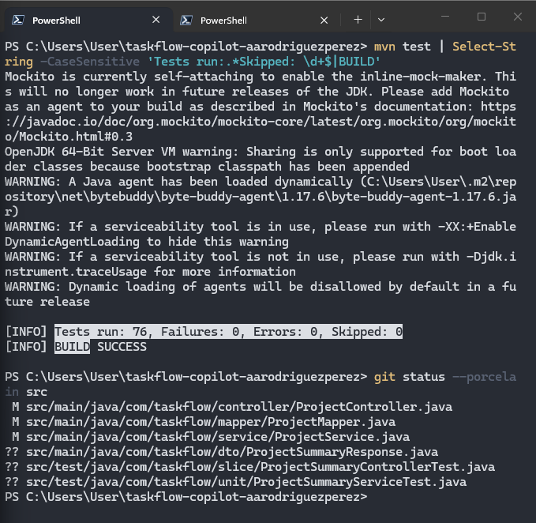
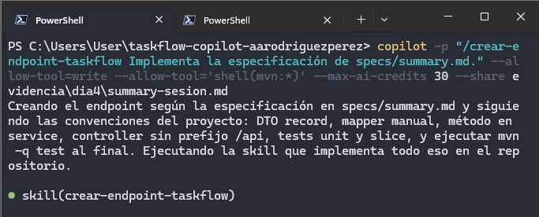
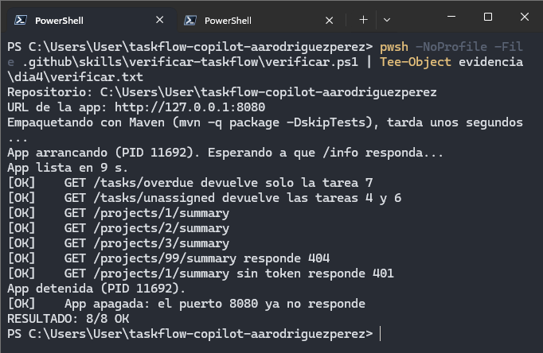
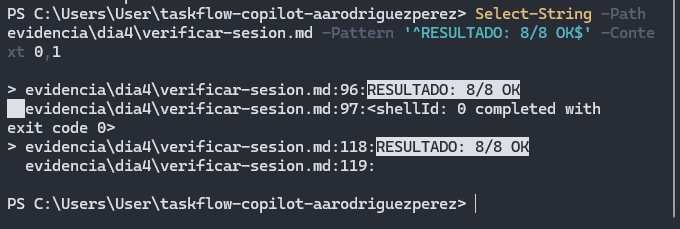

# Día 04 - Skills y agentes personalizados

## Objetivo

Durante el Día 04 se trabajó con **skills**, **agentes personalizados** y herramientas MCP para organizar el trabajo de GitHub Copilot CLI por responsabilidades.

La práctica tuvo cuatro objetivos principales:

- implementar `GET /projects/{id}/summary` utilizando una skill;
- verificar el resultado con una segunda skill y un script de punta a punta;
- separar revisión y testing mediante agentes personalizados;
- auditar una cuenta de AWS con un agente limitado por permisos de solo lectura.

Todo el trabajo se realizó sobre la rama:

```text
dia4-equipo
```

del repositorio:

```text
taskflow-copilot-aarodriguezperez
```

---

# 1. Preparación del Día 04

Antes de iniciar se actualizó `academyMty` y se comprobó que estuvieran disponibles los recursos del día:

- skills;
- agentes;
- scripts de verificación;
- archivos de referencia;
- archivos para la auditoría de AWS.

También se confirmó que `main` contenía los endpoints implementados durante el Día 02:

```text
GET /tasks/overdue
GET /tasks/unassigned
```

y que el issue creado durante el Día 03 seguía disponible:

```text
#2 - GET /projects/{id}/summary
```

Para evitar cargar herramientas innecesarias durante las sesiones del día, se deshabilitaron temporalmente los servidores MCP utilizados anteriormente:

```text
taskflow
playwright
aws-knowledge
```

Después se creó la rama:

```text
dia4-equipo
```

y se agregó la especificación:

```text
specs/summary.md
```

---

# 2. Skills del proyecto

## MP-1 · Agregar las skills

Se incorporaron al repositorio:

```text
.github/skills/crear-endpoint-taskflow/
.github/skills/verificar-taskflow/
```

La primera contiene la receta para implementar endpoints respetando la estructura de TaskFlow.

La segunda incluye un script para comprobar la aplicación de punta a punta.

Con:

```powershell
copilot skill list
```

se verificó que ambas aparecieran como **Project skills**.

---

## MP-2 · Romper y restaurar el frontmatter

Se modificó temporalmente:

```text
.github/skills/verificar-taskflow/SKILL.md
```

eliminando la primera línea del frontmatter.

La skill dejó de cargarse y Copilot reportó:

```text
missing or malformed YAML frontmatter
```

Después se restauró el archivo original y se confirmó que ambas skills volvieran a estar disponibles.

Este ejercicio permitió comprobar que el formato de `SKILL.md` forma parte de la configuración necesaria para que una skill pueda ser detectada por Copilot.

---

# 3. Implementación de `GET /projects/{id}/summary`

## MP-3 · Invocar `crear-endpoint-taskflow`

La implementación se solicitó invocando explícitamente:

```text
/crear-endpoint-taskflow
```

sobre:

```text
specs/summary.md
```

La receta indicaba, entre otras reglas:

- reutilizar las clases existentes;
- implementar el método en el service que el controller ya utiliza;
- crear los tests nuevos en clases independientes;
- consultar `plantillas.md` antes de escribir el código.

Al finalizar, la suite pasó de:

```text
72 tests
```

a:

```text
76 tests
```

con:

```text
Failures: 0
Errors: 0
Skipped: 0
BUILD SUCCESS
```

Los tests nuevos fueron creados en archivos independientes, sin modificar tests existentes.



---

## MP-4 · Confirmar que la skill fue utilizada

El resultado final no demostraba por sí solo que Copilot hubiera seguido la receta.

Por ello se revisó:

```text
evidencia/dia4/summary-sesion.md
```

buscando:

```text
Skill "crear-endpoint-taskflow" loaded successfully
```

La línea apareció correctamente.



Después se eliminaron del transcript las líneas que podían contener contraseñas temporales generadas por Spring Security y se realizó el commit de la implementación.

---

# 4. Skill `verificar-taskflow`

## MP-5 · Ejecutar el script manualmente

La skill incluye:

```text
.github/skills/verificar-taskflow/verificar.ps1
```

El script realiza cinco acciones principales:

1. empaqueta la aplicación;
2. arranca TaskFlow con H2;
3. espera a que la aplicación y la semilla estén disponibles;
4. ejecuta verificaciones reales;
5. apaga la aplicación al finalizar.

Las verificaciones incluyeron:

```text
GET /tasks/overdue
GET /tasks/unassigned
GET /projects/1/summary
GET /projects/2/summary
GET /projects/3/summary
404 para proyecto inexistente
401 sin token
apagado de la aplicación
```

El resultado fue:

```text
RESULTADO: 8/8 OK
```



Esto permitió validar la implementación contra la aplicación real y no únicamente mediante mocks.

---

## MP-6 · Ejecutar la verificación mediante Copilot

Después se pidió a Copilot ejecutar la misma comprobación utilizando:

```text
/verificar-taskflow
```

El transcript mostró el resultado:

```text
RESULTADO: 8/8 OK
```

seguido de:

```text
<shellId: ... completed with exit code 0>
```

Esta segunda línea demuestra que no era únicamente una afirmación del modelo, sino la salida real del script con código de ejecución correcto.



---

# 5. Agentes personalizados

## MP-7 · Crear el equipo

Se incorporaron:

```text
.github/agents/revisor.agent.md
.github/agents/tester.agent.md
```

Al consultar `/agent`, Copilot reconoció ambos agentes personalizados dentro del proyecto.


Los roles quedaron separados de la siguiente forma:

| Agente | Herramientas principales | Responsabilidad |
| --- | --- | --- |
| `revisor` | `read`, `search` | analizar la implementación sin modificarla |
| `tester` | `read`, `search`, `edit`, `execute` | agregar los tests faltantes y ejecutar Maven |

---

# 6. Agente `revisor`

## MP-8 · Revisar lo implementado por la skill

Se generó un diff de los cambios realizados y se pidió al agente `revisor` compararlo con:

```text
specs/summary.md
```

El revisor entregó:

- hallazgos;
- sugerencias;
- casos sin test;
- un veredicto.

La comprobación posterior confirmó que no había modificado ningún archivo de `src`.


---

## MP-9 · Intentar que el revisor edite

Para probar la restricción de herramientas, el revisor fue ejecutado con:

```text
--allow-all-tools
```

y se le pidió corregir directamente uno de sus hallazgos.

A pesar del permiso amplio de la sesión, no pudo modificar archivos porque su definición únicamente contiene herramientas de lectura y búsqueda.


Este ejercicio mostró que los permisos de sesión no pueden conceder una herramienta que el agente no tiene declarada.

---

# 7. Agente `tester`

## MP-10 · Agregar la cobertura faltante

El agente `tester` utilizó:

- `specs/summary.md`;
- los casos sin test detectados por el revisor;
- los tests existentes del endpoint.

Durante la revisión del resultado se detectaron algunos cambios innecesarios sobre tests ya existentes. Esos cambios fueron restaurados y se conservó únicamente la nueva cobertura requerida.

El resultado final fue:

```text
Tests run: 77
Failures: 0
Errors: 0
Skipped: 0
BUILD SUCCESS
```


De esta forma, la suite aumentó de 76 a 77 tests sin cambiar el comportamiento de casos existentes.

---

# 8. Auditoría de AWS con un agente de solo lectura

## MP-11 · Crear `mcp-readonly`

Para auditar la cuenta utilizada durante la Semana 05 se creó temporalmente:

```text
mcp-readonly
```

con:

```text
ViewOnlyAccess
```

La credencial se configuró únicamente de manera local mediante:

```text
aws configure --profile mcp-readonly
```

y se comprobó con `get-caller-identity`.

La Access Key y la Secret Access Key no fueron agregadas al repositorio ni utilizadas dentro de prompts.

---

## MP-12 · Agente `auditor-aws` y skill `limpieza-aws`

Se incorporaron:

```text
.github/agents/auditor-aws.agent.md
.github/skills/limpieza-aws/
```

El agente declara el servidor:

```text
aws-ro
```

que se conecta mediante el perfil:

```text
mcp-readonly
```

El control efectivo de solo lectura estaba en IAM mediante `ViewOnlyAccess`.

---

## MP-13 · Auditoría de la cuenta

El agente ejecutó una llamada real mediante:

```text
aws___run_script
```

para revisar los recursos de AWS.

El resultado final fue:

```text
Veredicto: CUENTA LIMPIA
```


También se realizó una prueba controlada de escritura intentando crear un bucket S3.

AWS rechazó la operación con:

```text
AccessDenied
mcp-readonly is not authorized to perform: s3:CreateBucket
```

El bucket no fue creado.

Los transcripts completos de AWS se movieron fuera del repositorio debido a que incluían identificadores de cuenta y recursos.

En el repositorio se conservó únicamente:

```text
evidencia/dia4/aws-resultado.txt
```

con la información sensible anonimizada.

---

# 9. Integrador

## 9.1 Romper la regla de tareas vencidas

Como prueba final se modificó intencionalmente la lógica utilizada para calcular tareas vencidas dentro del resumen.

La implementación correcta reutilizaba:

```java
Task::estaVencida
```

y fue sustituida temporalmente por una condición que solo revisaba la fecha y no el estado.

Esto provocó que tareas `DONE` con fecha pasada fueran contadas como vencidas.

El verificador detectó el problema:

```text
RESULTADO: 2 de 8 con FALLA
```


Este resultado mostró el valor de probar contra la semilla real, ya que permite detectar errores de negocio que pueden no aparecer en una suite basada únicamente en datos controlados por tests.

---

## 9.2 Restaurar la implementación

Se restauró la regla correcta y se comprobó que `src` regresara a su estado previo.

Después se ejecutó nuevamente:

```text
verificar.ps1
```

y el resultado volvió a ser:

```text
RESULTADO: 8/8 OK
```


Con esto se confirmó que el bug introducido para la práctica había sido eliminado antes de integrar la rama.

---

# 10. Pull Request y merge

Antes de publicar se revisaron las evidencias para evitar que viajaran:

- Access Keys;
- Secret Access Keys;
- contraseñas temporales;
- ARN con números de cuenta.

Después se publicó:

```text
dia4-equipo
```

y se abrió el Pull Request:

```text
#4 - GET /projects/{id}/summary con el equipo de .github
```

El PR incluyó:

- `.github/skills/`;
- `.github/agents/`;
- `specs/summary.md`;
- la implementación del endpoint;
- tests;
- evidencia del Día 04.

Finalmente se realizó el merge a `main`.


---

# 11. Cierre del issue

La implementación correspondía al issue creado durante el Día 03:

```text
#2 - GET /projects/{id}/summary
```

Después del merge, el issue quedó cerrado y asociado al PR `#4`.


---

# 12. Limpieza

Al finalizar se restauró la configuración utilizada durante los días anteriores.

Se habilitaron nuevamente los servidores MCP:

```text
taskflow
playwright
aws-knowledge
```

También se eliminó el usuario temporal:

```text
mcp-readonly
```

junto con:

- sus Access Keys;
- `ViewOnlyAccess`;
- el perfil de `$HOME\.aws\credentials`;
- el perfil de `$HOME\.aws\config`.

De esta forma, las credenciales temporales utilizadas para la auditoría no permanecieron activas después de la práctica.

---

# Resultados del Día 04

Al finalizar se logró:

- incorporar skills reutilizables al repositorio;
- comprobar el efecto de un frontmatter inválido;
- implementar `GET /projects/{id}/summary` mediante `crear-endpoint-taskflow`;
- confirmar en el transcript que la skill fue cargada;
- aumentar la suite de **72 a 76 tests** durante la implementación;
- verificar TaskFlow con **8/8 OK**;
- ejecutar la skill de verificación mediante Copilot y comprobar `exit code 0`;
- registrar los agentes `revisor` y `tester`;
- revisar la implementación sin modificar código;
- demostrar que el `revisor` no podía escribir incluso con `--allow-all-tools`;
- agregar cobertura mediante el agente `tester`;
- finalizar con **77 tests en verde**;
- auditar AWS con un usuario IAM de solo lectura;
- obtener **Veredicto: CUENTA LIMPIA**;
- demostrar mediante `AccessDenied` que `mcp-readonly` no podía crear un bucket;
- introducir un bug intencional y obtener **2 de 8 con FALLA**;
- restaurar la implementación y regresar a **8/8 OK**;
- integrar la rama mediante el PR `#4`;
- cerrar el issue `#2`.

---

# Conclusión

El Día 04 permitió pasar de utilizar un único agente general a organizar el trabajo mediante componentes especializados.

La diferencia entre los mecanismos utilizados puede resumirse así:

| Mecanismo | Función |
| --- | --- |
| `copilot-instructions.md` | reglas generales que aplican siempre |
| Skill | receta reutilizable cargada cuando una tarea la necesita |
| Agente personalizado | rol con instrucciones y herramientas propias |
| Servidor MCP | acceso a herramientas o sistemas externos |

La práctica mostró además que las restricciones deben aplicarse en capas.

El agente `revisor` no pudo modificar archivos porque no contaba con herramientas de escritura, mientras que `auditor-aws` no pudo escribir en AWS porque IAM lo impedía mediante `ViewOnlyAccess`.

Finalmente, el integrador confirmó que la verificación independiente sigue siendo necesaria: al introducir una regla incorrecta, `verificar-taskflow` detectó el problema contra la aplicación real y permitió comprobar posteriormente que la corrección devolvía el sistema a `8/8 OK`.
